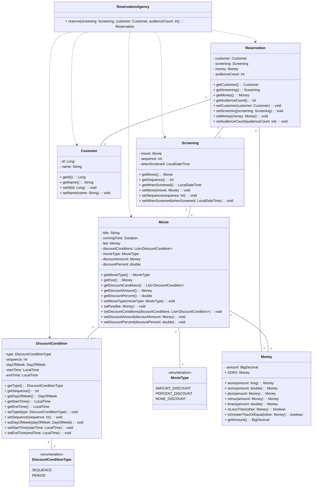
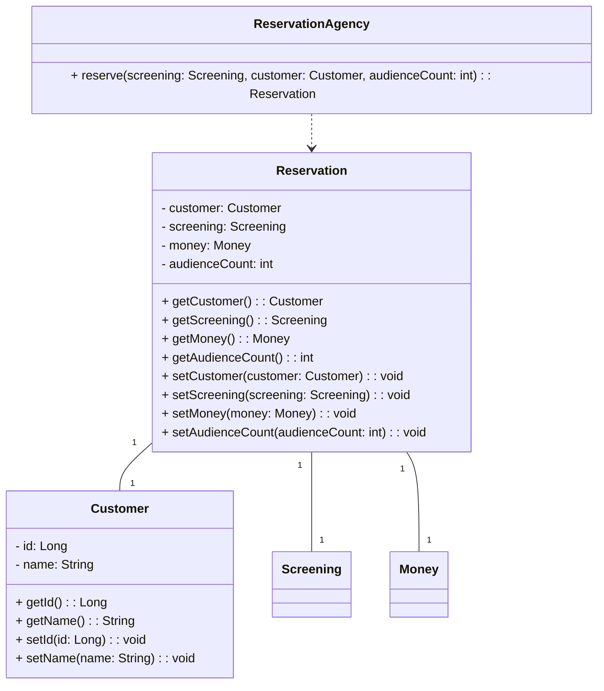
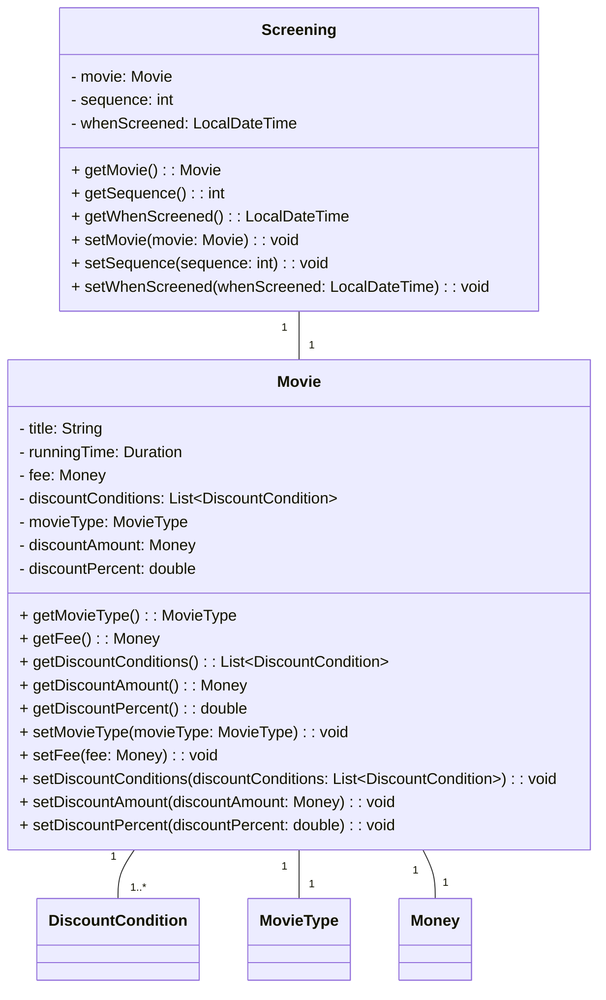
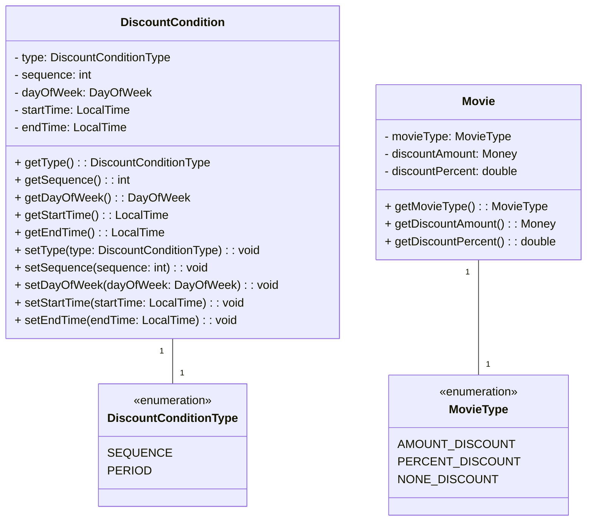
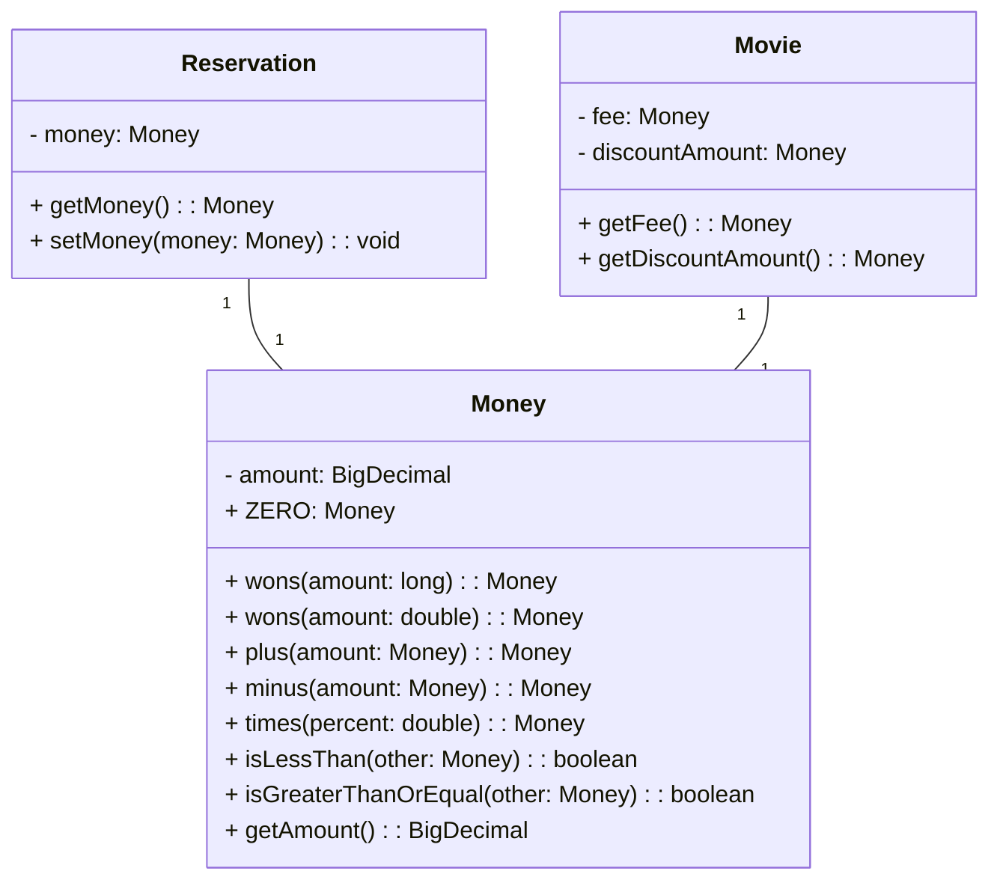

# 영화 예매 시스템 클래스 다이어그램

## 전체 클래스 다이어그램

전체 클래스 다이어그램은 예약 대행 클래스(`ReservationAgency`)를 중심으로 설계되었습니다. 
예약 대행 클래스는 상영 정보, 고객 정보를 받아 할인 조건을 검증하고 최종 예약을 생성합니다.

## 예약 도메인

## 상영 도메인

## 할인 도메인

## 공통 도메인

