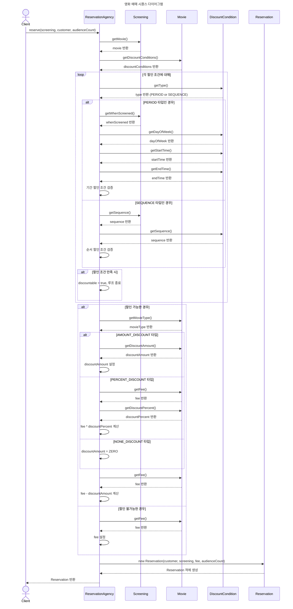
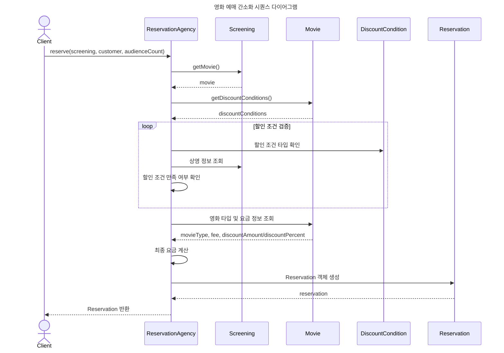
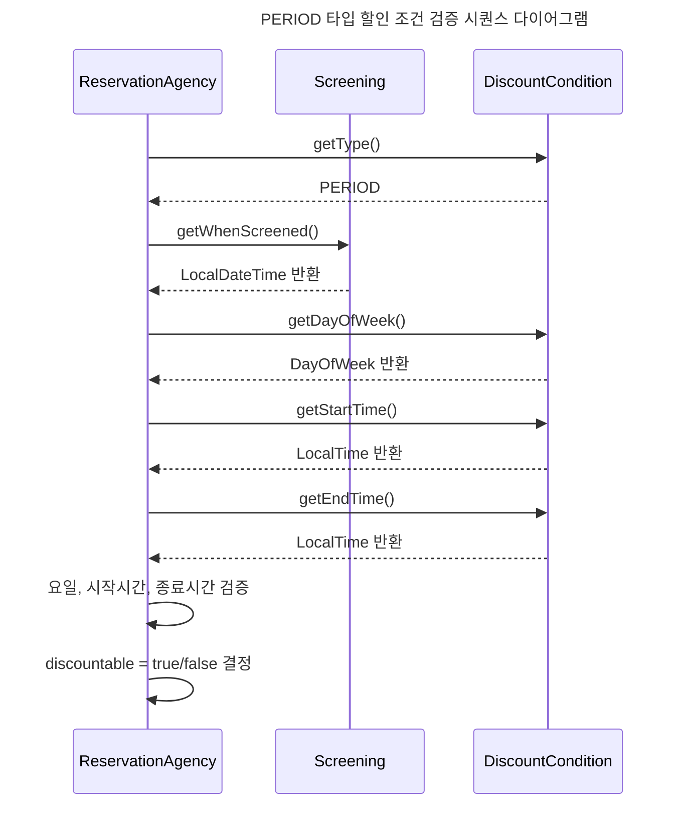
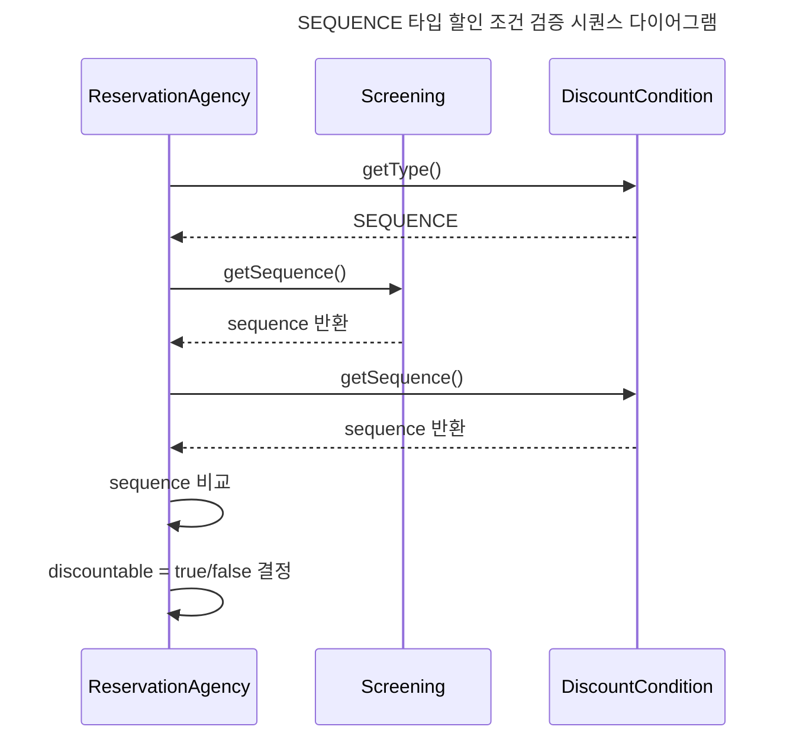
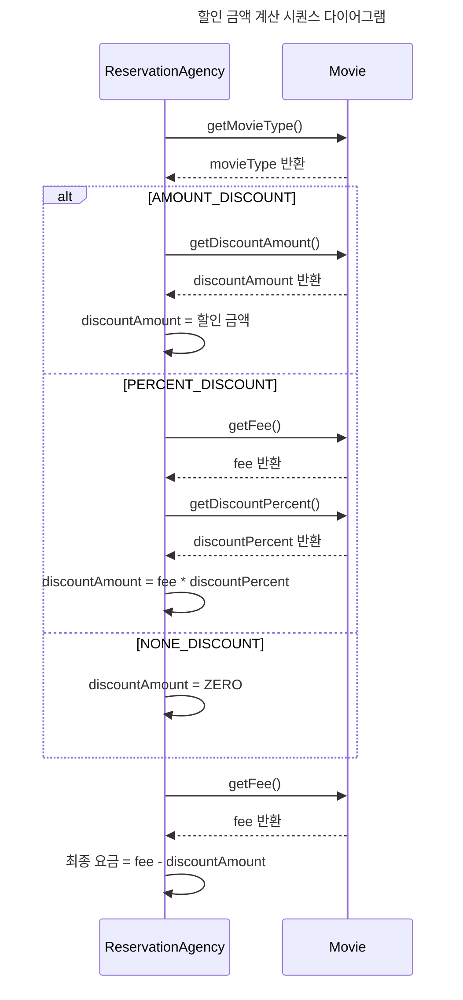

# SEQUENCE DIAGRAM

## 영화 예매 시퀀스 다이어그램

영화 예매 전체 흐름에서 성공 케이스 중심으로 시퀀스 다이어그램을 작성했습니다. 
이 시퀀스 다이어그램은 영화 예매 시스템의 전체적인 흐름을 직관적으로 보여주며, 
할인 조건 검증 및 요금 계산 단계를 포함하고 있습니다.

### 영화 예매 (할인 조건 검증 및 요금 계산)

### 영화 예매 (간소화 버전)

### 할인 조건 검증 상세 (PERIOD 타입)

### 할인 조건 검증 상세 (SEQUENCE 타입)

### 할인 금액 계산 상세

