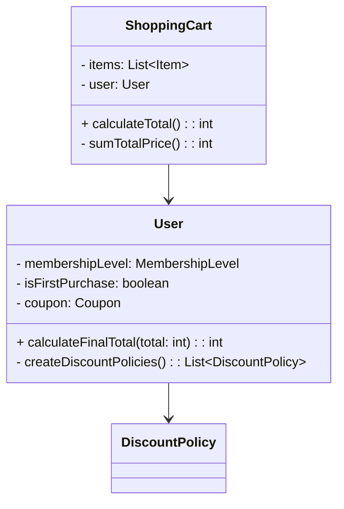
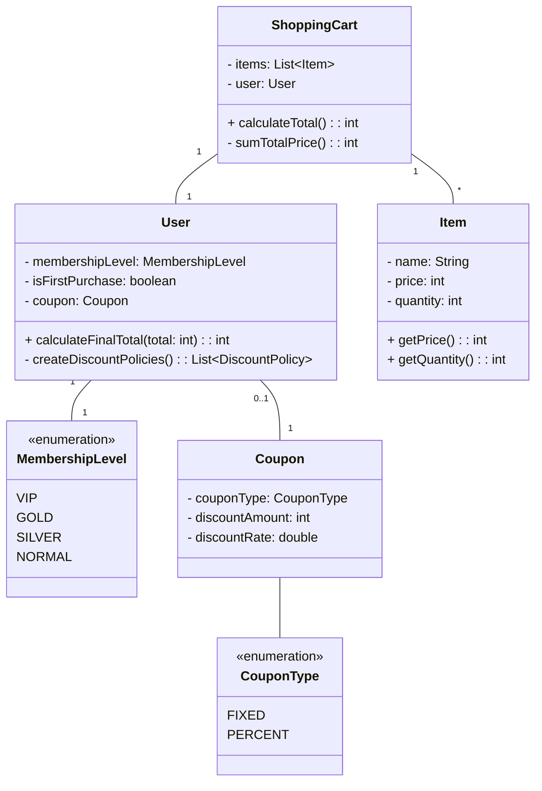
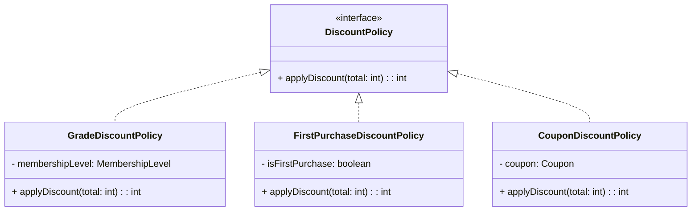
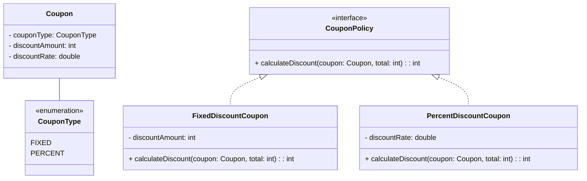
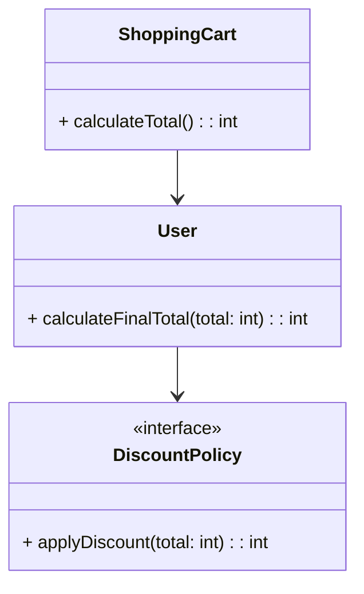

# discount 프로젝트 클래스 다이어그램

## 전체 클래스 다이어그램

전체 클래스 다이어그램은 할인 정책을 적용하는 쇼핑카트 시스템을 보여줍니다.

```mermaid
classDiagram
    class ShoppingCart {
        - items: List~Item~
        - user: User
        + calculateTotal(): int
        - sumTotalPrice(): int
    }

    class User {
        - membershipLevel: MembershipLevel
        - isFirstPurchase: boolean
        - coupon: Coupon
        + calculateFinalTotal(total: int): int
        - createDiscountPolicies(): List~DiscountPolicy~
    }

    ShoppingCart --> User
    User --> DiscountPolicy
```

## 도메인 클래스

```mermaid
classDiagram
    class User {
        - membershipLevel: MembershipLevel
        - isFirstPurchase: boolean
        - coupon: Coupon
        + calculateFinalTotal(total: int): int
        - createDiscountPolicies(): List~DiscountPolicy~
    }

    class MembershipLevel {
        <<enumeration>>
        VIP
        GOLD
        SILVER
        NORMAL
    }

    class ShoppingCart {
        - items: List~Item~
        - user: User
        + calculateTotal(): int
        - sumTotalPrice(): int
    }

    class Item {
        - name: String
        - price: int
        - quantity: int
        + getPrice(): int
        + getQuantity(): int
    }

    class Coupon {
        - couponType: CouponType
        - discountAmount: int
        - discountRate: double
    }

    class CouponType {
        <<enumeration>>
        FIXED
        PERCENT
    }

    User "1" -- "1" MembershipLevel
    User "0..1" -- "1" Coupon
    ShoppingCart "1" -- "1" User
    ShoppingCart "1" -- "*" Item
    Coupon -- CouponType
```

## 할인 정책 도메인

```mermaid
classDiagram
    class DiscountPolicy {
        <<interface>>
        + applyDiscount(total: int): int
    }

    class GradeDiscountPolicy {
        - membershipLevel: MembershipLevel
        + applyDiscount(total: int): int
    }

    class FirstPurchaseDiscountPolicy {
        - isFirstPurchase: boolean
        + applyDiscount(total: int): int
    }

    class CouponDiscountPolicy {
        - coupon: Coupon
        + applyDiscount(total: int): int
    }

    DiscountPolicy <|.. GradeDiscountPolicy
    DiscountPolicy <|.. FirstPurchaseDiscountPolicy
    DiscountPolicy <|.. CouponDiscountPolicy
```

## 쿠폰 도메인

```mermaid
classDiagram
    class Coupon {
        - couponType: CouponType
        - discountAmount: int
        - discountRate: double
    }

    class CouponType {
        <<enumeration>>
        FIXED
        PERCENT
    }

    class CouponPolicy {
        <<interface>>
        + calculateDiscount(coupon: Coupon, total: int): int
    }

    class FixedDiscountCoupon {
        - discountAmount: int
        + calculateDiscount(coupon: Coupon, total: int): int
    }

    class PercentDiscountCoupon {
        - discountRate: double
        + calculateDiscount(coupon: Coupon, total: int): int
    }

    Coupon -- CouponType
    CouponPolicy <|.. FixedDiscountCoupon
    CouponPolicy <|.. PercentDiscountCoupon
```

## 할인 계산 흐름

```mermaid
classDiagram
    class ShoppingCart {
        + calculateTotal(): int
    }

    class User {
        + calculateFinalTotal(total: int): int
    }

    class DiscountPolicy {
        <<interface>>
        + applyDiscount(total: int): int
    }

    ShoppingCart --> User
    User --> DiscountPolicy
```

