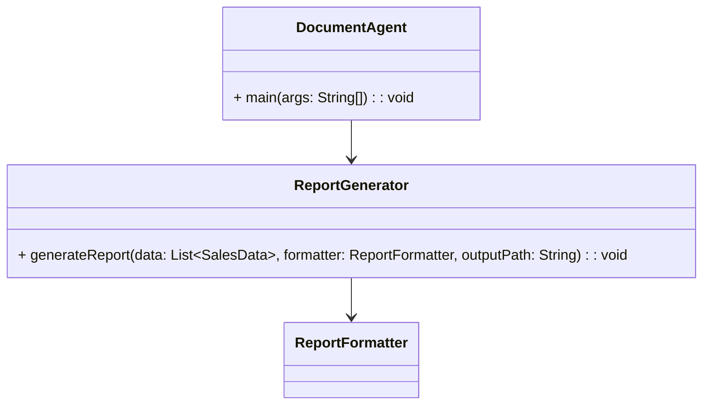
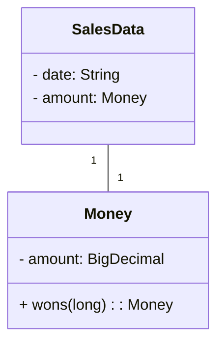
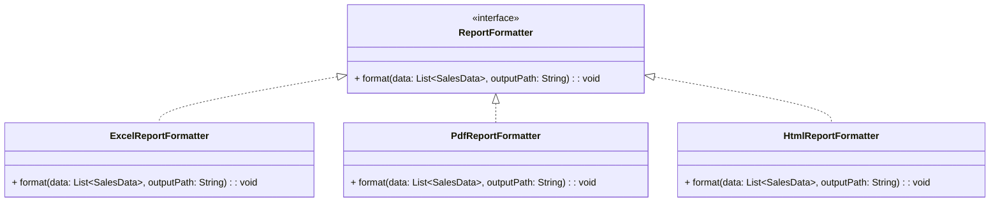
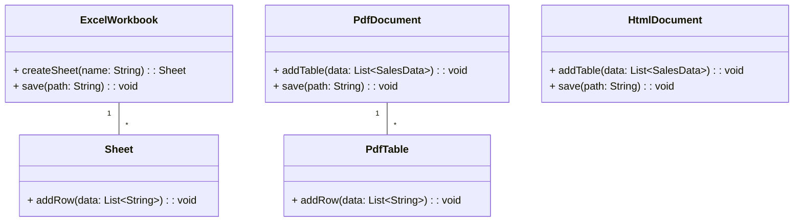
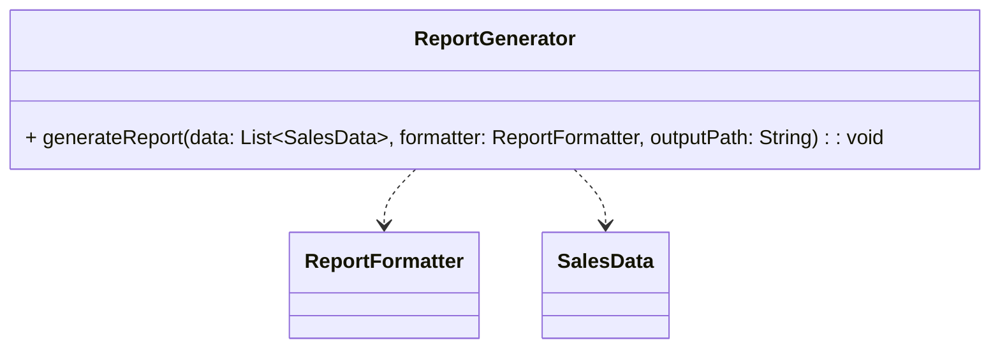
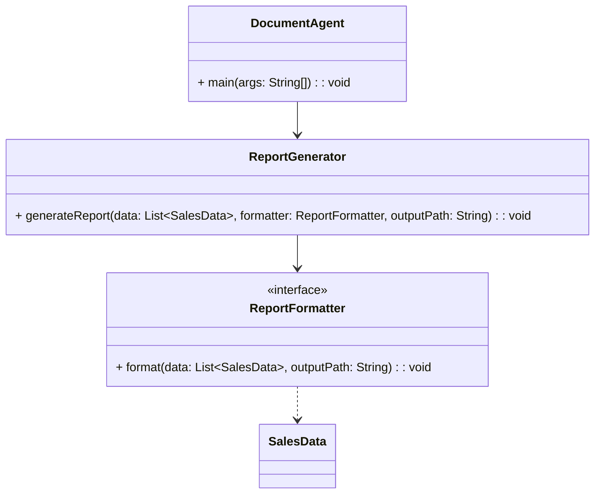

# formatter 프로젝트 클래스 다이어그램

## 전체 클래스 다이어그램

전체 클래스 다이어그램은 리포트 포맷터 시스템을 보여줍니다.

```mermaid
classDiagram
    class ReportGenerator {
        + generateReport(data: List~SalesData~, formatter: ReportFormatter, outputPath: String): void
    }

    class DocumentAgent {
        + main(args: String[]): void
    }

    ReportGenerator --> ReportFormatter
    DocumentAgent --> ReportGenerator
```

## 도메인 클래스

```mermaid
classDiagram
    class SalesData {
        - date: String
        - amount: Money
    }

    class Money {
        - amount: BigDecimal
        + wons(long): Money
    }

    SalesData "1" -- "1" Money
```

## 포맷터 도메인

```mermaid
classDiagram
    class ReportFormatter {
        <<interface>>
        + format(data: List~SalesData~, outputPath: String): void
    }

    class ExcelReportFormatter {
        + format(data: List~SalesData~, outputPath: String): void
    }

    class PdfReportFormatter {
        + format(data: List~SalesData~, outputPath: String): void
    }

    class HtmlReportFormatter {
        + format(data: List~SalesData~, outputPath: String): void
    }

    ReportFormatter <|.. ExcelReportFormatter
    ReportFormatter <|.. PdfReportFormatter
    ReportFormatter <|.. HtmlReportFormatter
```

## 문서 도메인

```mermaid
classDiagram
    class ExcelWorkbook {
        + createSheet(name: String): Sheet
        + save(path: String): void
    }

    class Sheet {
        + addRow(data: List~String~): void
    }

    class PdfDocument {
        + addTable(data: List~SalesData~): void
        + save(path: String): void
    }

    class PdfTable {
        + addRow(data: List~String~): void
    }

    class HtmlDocument {
        + addTable(data: List~SalesData~): void
        + save(path: String): void
    }

    ExcelWorkbook "1" -- "*" Sheet
    PdfDocument "1" -- "*" PdfTable
```

## 서비스 계층

```mermaid
classDiagram
    class ReportGenerator {
        + generateReport(data: List~SalesData~, formatter: ReportFormatter, outputPath: String): void
    }

    ReportGenerator ..> ReportFormatter
    ReportGenerator ..> SalesData
```

## 리포트 생성 흐름

```mermaid
classDiagram
    class DocumentAgent {
        + main(args: String[]): void
    }

    class ReportGenerator {
        + generateReport(data: List~SalesData~, formatter: ReportFormatter, outputPath: String): void
    }

    class ReportFormatter {
        <<interface>>
        + format(data: List~SalesData~, outputPath: String): void
    }

    DocumentAgent --> ReportGenerator
    ReportGenerator --> ReportFormatter
    ReportFormatter ..> SalesData
```

