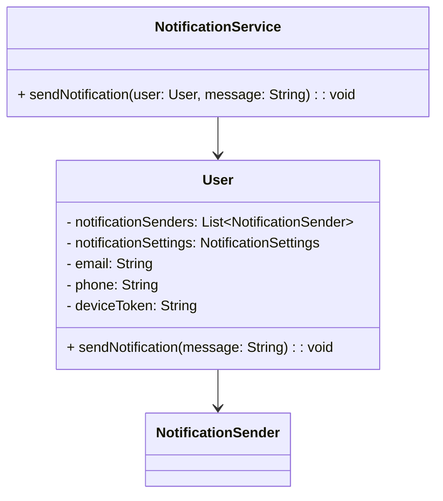
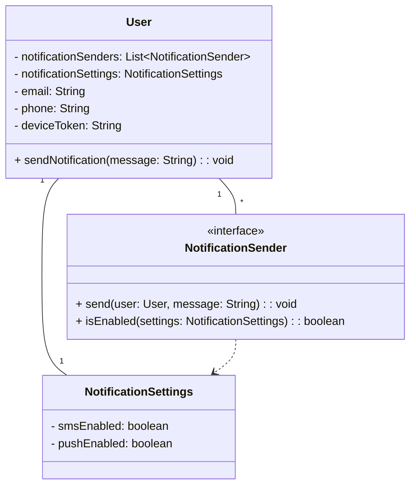
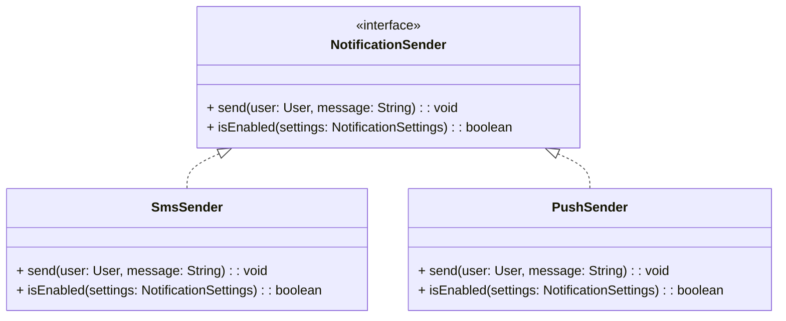
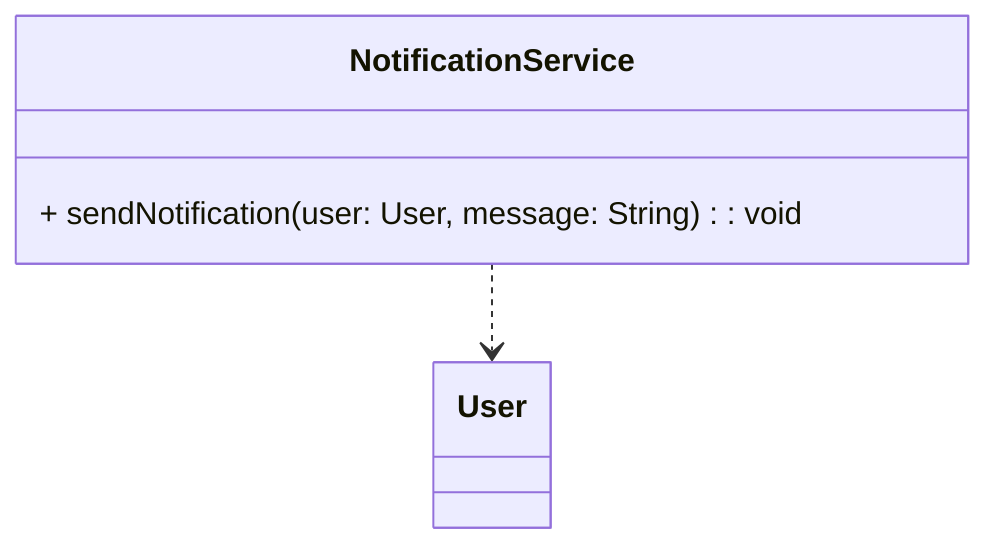
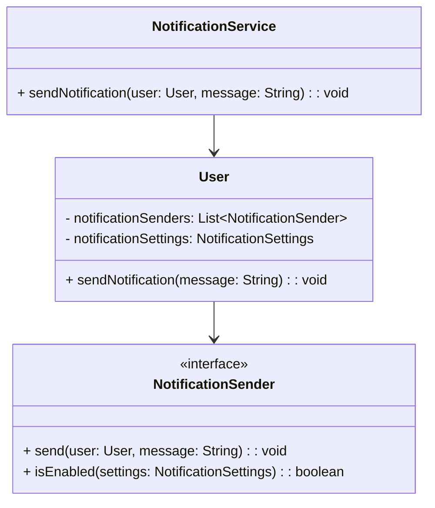

# notification 프로젝트 클래스 다이어그램

## 전체 클래스 다이어그램

전체 클래스 다이어그램은 알림 전송 시스템을 보여줍니다.

```mermaid
classDiagram
    class NotificationService {
        + sendNotification(user: User, message: String): void
    }

    class User {
        - notificationSenders: List~NotificationSender~
        - notificationSettings: NotificationSettings
        - email: String
        - phone: String
        - deviceToken: String
        + sendNotification(message: String): void
    }

    NotificationService --> User
    User --> NotificationSender
```

## 도메인 클래스

```mermaid
classDiagram
    class User {
        - notificationSenders: List~NotificationSender~
        - notificationSettings: NotificationSettings
        - email: String
        - phone: String
        - deviceToken: String
        + sendNotification(message: String): void
    }

    class NotificationSettings {
        - smsEnabled: boolean
        - pushEnabled: boolean
    }

    class NotificationSender {
        <<interface>>
        + send(user: User, message: String): void
        + isEnabled(settings: NotificationSettings): boolean
    }

    User "1" -- "1" NotificationSettings
    User "1" -- "*" NotificationSender
    NotificationSender ..> NotificationSettings
```

## 알림 전송자 구현

```mermaid
classDiagram
    class NotificationSender {
        <<interface>>
        + send(user: User, message: String): void
        + isEnabled(settings: NotificationSettings): boolean
    }

    class SmsSender {
        + send(user: User, message: String): void
        + isEnabled(settings: NotificationSettings): boolean
    }

    class PushSender {
        + send(user: User, message: String): void
        + isEnabled(settings: NotificationSettings): boolean
    }

    NotificationSender <|.. SmsSender
    NotificationSender <|.. PushSender
```

## 서비스 계층

```mermaid
classDiagram
    class NotificationService {
        + sendNotification(user: User, message: String): void
    }

    NotificationService ..> User
```

## 알림 전송 흐름

```mermaid
classDiagram
    class NotificationService {
        + sendNotification(user: User, message: String): void
    }

    class User {
        - notificationSenders: List~NotificationSender~
        - notificationSettings: NotificationSettings
        + sendNotification(message: String): void
    }

    class NotificationSender {
        <<interface>>
        + send(user: User, message: String): void
        + isEnabled(settings: NotificationSettings): boolean
    }

    NotificationService --> User
    User --> NotificationSender
```

