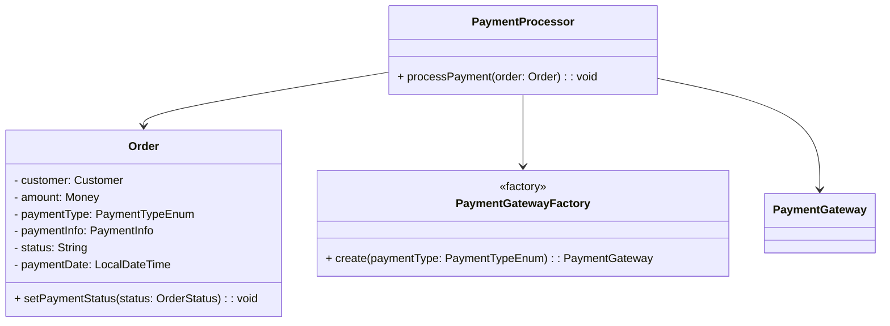
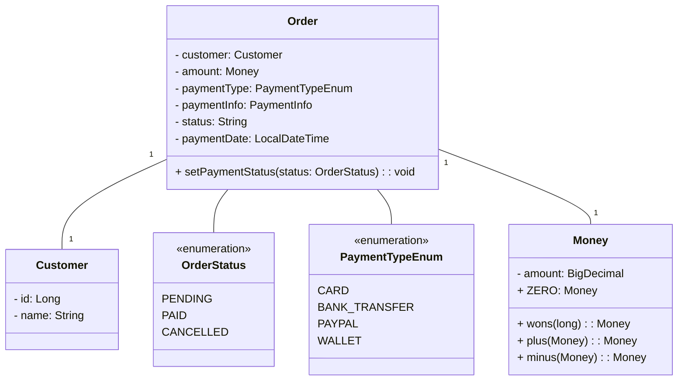
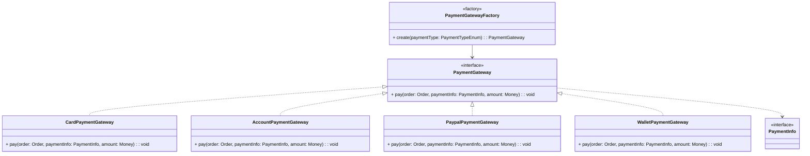
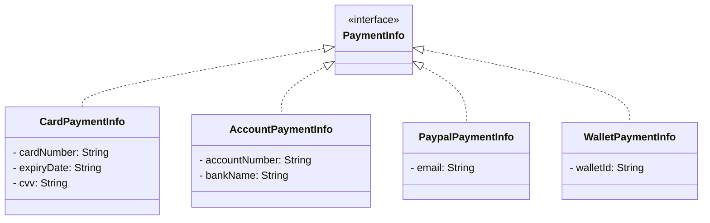
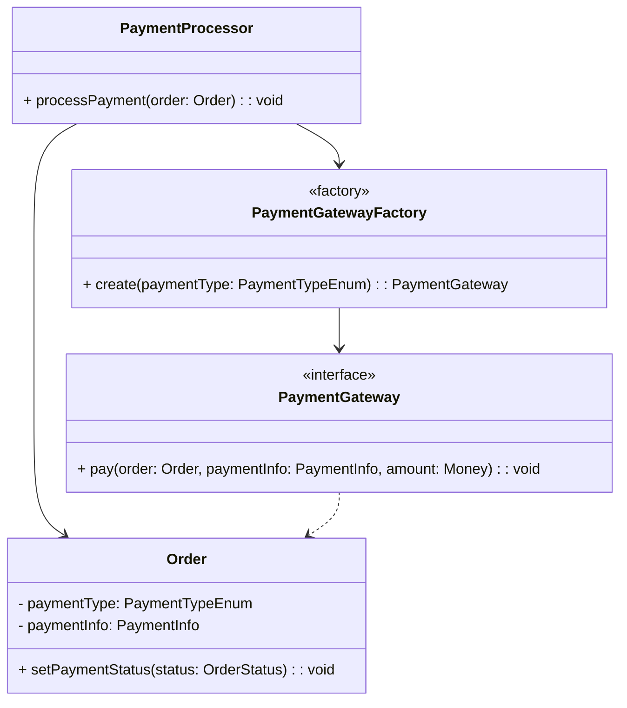

# order 프로젝트 클래스 다이어그램

## 전체 클래스 다이어그램

전체 클래스 다이어그램은 결제 게이트웨이를 사용하는 주문 시스템을 보여줍니다.

```mermaid
classDiagram
    class PaymentProcessor {
        + processPayment(order: Order): void
    }

    class Order {
        - customer: Customer
        - amount: Money
        - paymentType: PaymentTypeEnum
        - paymentInfo: PaymentInfo
        - status: String
        - paymentDate: LocalDateTime
        + setPaymentStatus(status: OrderStatus): void
    }

    class PaymentGatewayFactory {
        <<factory>>
        + create(paymentType: PaymentTypeEnum): PaymentGateway
    }

    PaymentProcessor --> Order
    PaymentProcessor --> PaymentGatewayFactory
    PaymentProcessor --> PaymentGateway
```

## 도메인 클래스

```mermaid
classDiagram
    class Customer {
        - id: Long
        - name: String
    }

    class Order {
        - customer: Customer
        - amount: Money
        - paymentType: PaymentTypeEnum
        - paymentInfo: PaymentInfo
        - status: String
        - paymentDate: LocalDateTime
        + setPaymentStatus(status: OrderStatus): void
    }

    class OrderStatus {
        <<enumeration>>
        PENDING
        PAID
        CANCELLED
    }

    class PaymentTypeEnum {
        <<enumeration>>
        CARD
        BANK_TRANSFER
        PAYPAL
        WALLET
    }

    class Money {
        - amount: BigDecimal
        + ZERO: Money
        + wons(long): Money
        + plus(Money): Money
        + minus(Money): Money
    }

    Order "1" -- "1" Customer
    Order -- OrderStatus
    Order -- PaymentTypeEnum
    Order "1" -- "1" Money
```

## 결제 게이트웨이 도메인

```mermaid
classDiagram
    class PaymentGateway {
        <<interface>>
        + pay(order: Order, paymentInfo: PaymentInfo, amount: Money): void
    }

    class PaymentInfo {
        <<interface>>
    }

    class CardPaymentGateway {
        + pay(order: Order, paymentInfo: PaymentInfo, amount: Money): void
    }

    class AccountPaymentGateway {
        + pay(order: Order, paymentInfo: PaymentInfo, amount: Money): void
    }

    class PaypalPaymentGateway {
        + pay(order: Order, paymentInfo: PaymentInfo, amount: Money): void
    }

    class WalletPaymentGateway {
        + pay(order: Order, paymentInfo: PaymentInfo, amount: Money): void
    }

    class PaymentGatewayFactory {
        <<factory>>
        + create(paymentType: PaymentTypeEnum): PaymentGateway
    }

    PaymentGateway <|.. CardPaymentGateway
    PaymentGateway <|.. AccountPaymentGateway
    PaymentGateway <|.. PaypalPaymentGateway
    PaymentGateway <|.. WalletPaymentGateway
    PaymentGatewayFactory --> PaymentGateway
    PaymentGateway ..> PaymentInfo
```

## 결제 정보 도메인

```mermaid
classDiagram
    class PaymentInfo {
        <<interface>>
    }

    class CardPaymentInfo {
        - cardNumber: String
        - expiryDate: String
        - cvv: String
    }

    class AccountPaymentInfo {
        - accountNumber: String
        - bankName: String
    }

    class PaypalPaymentInfo {
        - email: String
    }

    class WalletPaymentInfo {
        - walletId: String
    }

    PaymentInfo <|.. CardPaymentInfo
    PaymentInfo <|.. AccountPaymentInfo
    PaymentInfo <|.. PaypalPaymentInfo
    PaymentInfo <|.. WalletPaymentInfo
```

## 결제 처리 흐름

```mermaid
classDiagram
    class PaymentProcessor {
        + processPayment(order: Order): void
    }

    class PaymentGatewayFactory {
        <<factory>>
        + create(paymentType: PaymentTypeEnum): PaymentGateway
    }

    class PaymentGateway {
        <<interface>>
        + pay(order: Order, paymentInfo: PaymentInfo, amount: Money): void
    }

    class Order {
        - paymentType: PaymentTypeEnum
        - paymentInfo: PaymentInfo
        + setPaymentStatus(status: OrderStatus): void
    }

    PaymentProcessor --> Order
    PaymentProcessor --> PaymentGatewayFactory
    PaymentGatewayFactory --> PaymentGateway
    PaymentGateway ..> Order
```

