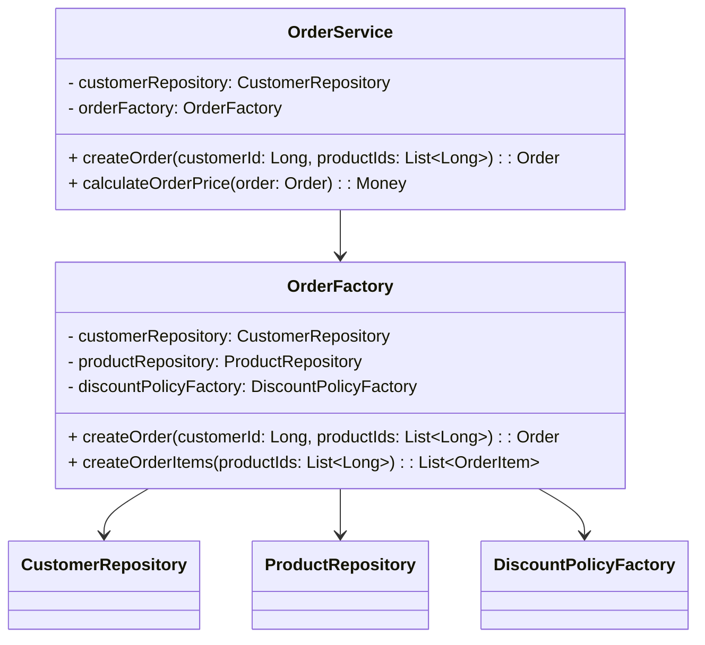
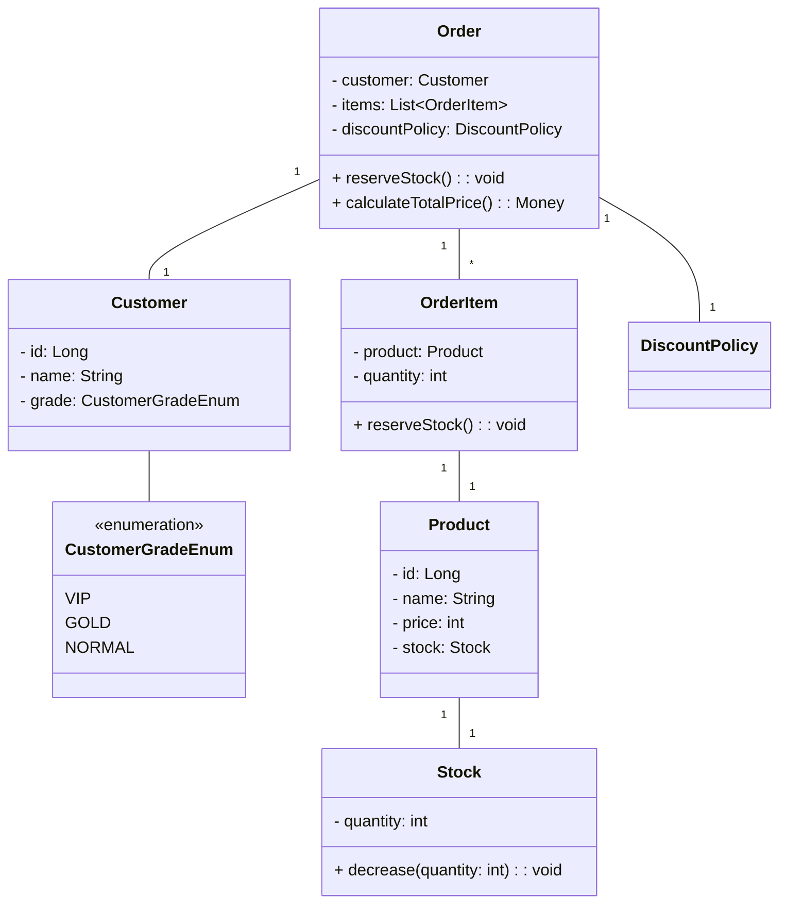
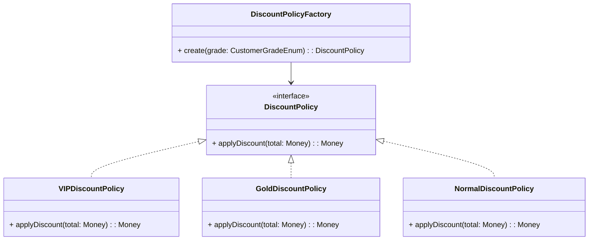
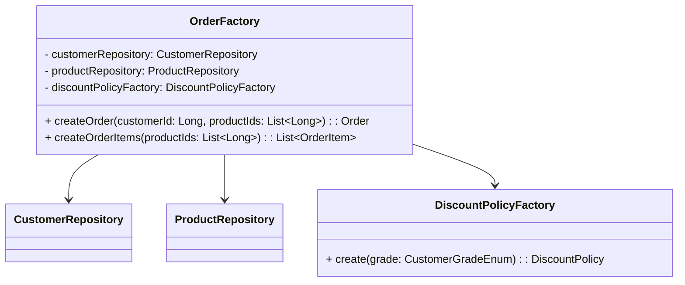
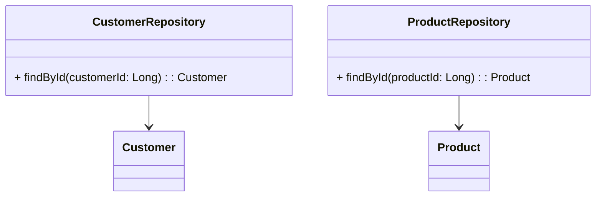
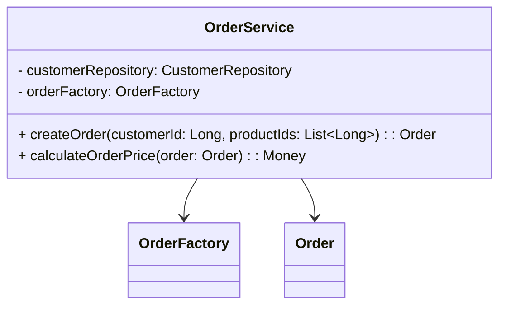

# order_factory 프로젝트 클래스 다이어그램

## 전체 클래스 다이어그램

전체 클래스 다이어그램은 팩토리 패턴을 사용하는 주문 시스템을 보여줍니다.

```mermaid
classDiagram
    class OrderService {
        - customerRepository: CustomerRepository
        - orderFactory: OrderFactory
        + createOrder(customerId: Long, productIds: List~Long~): Order
        + calculateOrderPrice(order: Order): Money
    }

    class OrderFactory {
        - customerRepository: CustomerRepository
        - productRepository: ProductRepository
        - discountPolicyFactory: DiscountPolicyFactory
        + createOrder(customerId: Long, productIds: List~Long~): Order
        + createOrderItems(productIds: List~Long~): List~OrderItem~
    }

    OrderService --> OrderFactory
    OrderFactory --> CustomerRepository
    OrderFactory --> ProductRepository
    OrderFactory --> DiscountPolicyFactory
```

## 도메인 클래스

```mermaid
classDiagram
    class Customer {
        - id: Long
        - name: String
        - grade: CustomerGradeEnum
    }

    class CustomerGradeEnum {
        <<enumeration>>
        VIP
        GOLD
        NORMAL
    }

    class Order {
        - customer: Customer
        - items: List~OrderItem~
        - discountPolicy: DiscountPolicy
        + reserveStock(): void
        + calculateTotalPrice(): Money
    }

    class OrderItem {
        - product: Product
        - quantity: int
        + reserveStock(): void
    }

    class Product {
        - id: Long
        - name: String
        - price: int
        - stock: Stock
    }

    class Stock {
        - quantity: int
        + decrease(quantity: int): void
    }

    Customer -- CustomerGradeEnum
    Order "1" -- "1" Customer
    Order "1" -- "*" OrderItem
    Order "1" -- "1" DiscountPolicy
    OrderItem "1" -- "1" Product
    Product "1" -- "1" Stock
```

## 할인 정책 도메인

```mermaid
classDiagram
    class DiscountPolicy {
        <<interface>>
        + applyDiscount(total: Money): Money
    }

    class VIPDiscountPolicy {
        + applyDiscount(total: Money): Money
    }

    class GoldDiscountPolicy {
        + applyDiscount(total: Money): Money
    }

    class NormalDiscountPolicy {
        + applyDiscount(total: Money): Money
    }

    class DiscountPolicyFactory {
        + create(grade: CustomerGradeEnum): DiscountPolicy
    }

    DiscountPolicy <|.. VIPDiscountPolicy
    DiscountPolicy <|.. GoldDiscountPolicy
    DiscountPolicy <|.. NormalDiscountPolicy
    DiscountPolicyFactory --> DiscountPolicy
```

## 팩토리 계층

```mermaid
classDiagram
    class OrderFactory {
        - customerRepository: CustomerRepository
        - productRepository: ProductRepository
        - discountPolicyFactory: DiscountPolicyFactory
        + createOrder(customerId: Long, productIds: List~Long~): Order
        + createOrderItems(productIds: List~Long~): List~OrderItem~
    }

    class DiscountPolicyFactory {
        + create(grade: CustomerGradeEnum): DiscountPolicy
    }

    OrderFactory --> CustomerRepository
    OrderFactory --> ProductRepository
    OrderFactory --> DiscountPolicyFactory
```

## 리포지토리 계층

```mermaid
classDiagram
    class CustomerRepository {
        + findById(customerId: Long): Customer
    }

    class ProductRepository {
        + findById(productId: Long): Product
    }

    CustomerRepository --> Customer
    ProductRepository --> Product
```

## 서비스 계층

```mermaid
classDiagram
    class OrderService {
        - customerRepository: CustomerRepository
        - orderFactory: OrderFactory
        + createOrder(customerId: Long, productIds: List~Long~): Order
        + calculateOrderPrice(order: Order): Money
    }

    OrderService --> OrderFactory
    OrderService --> Order
```

