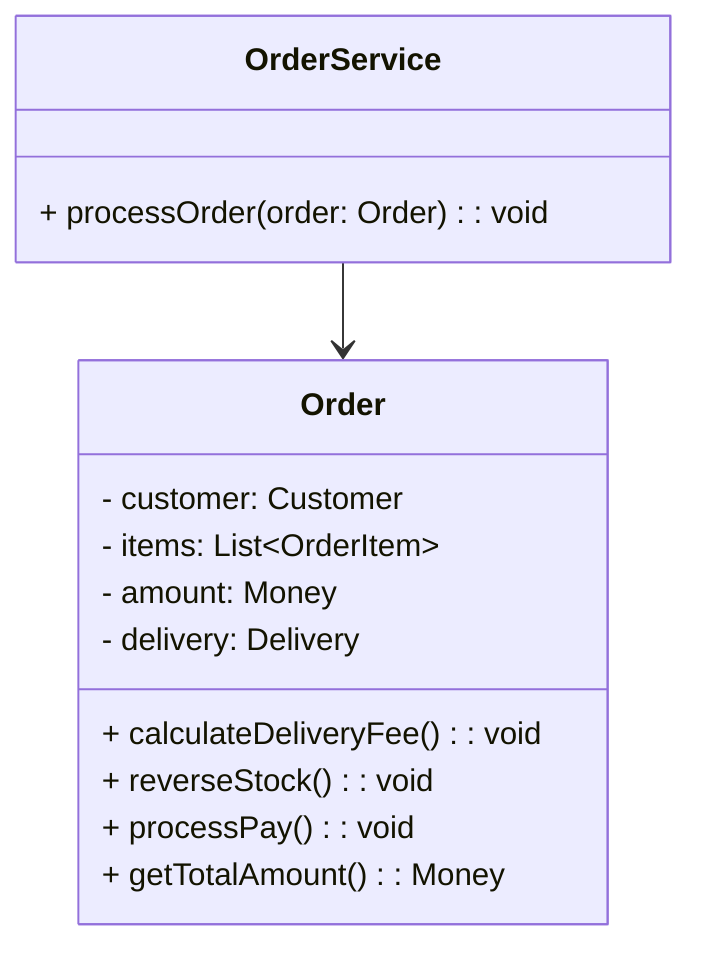
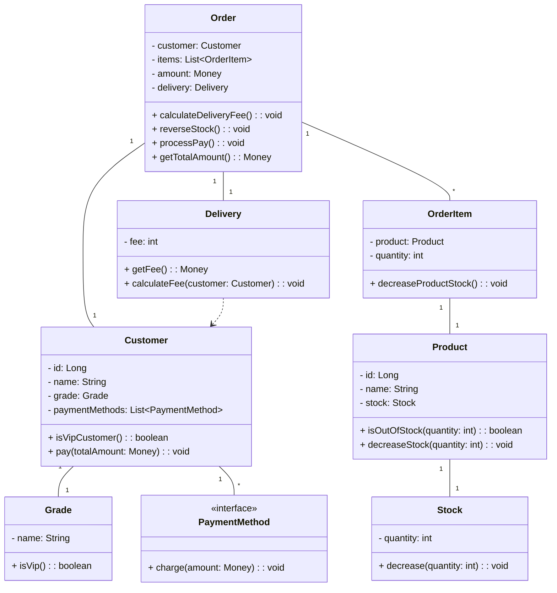
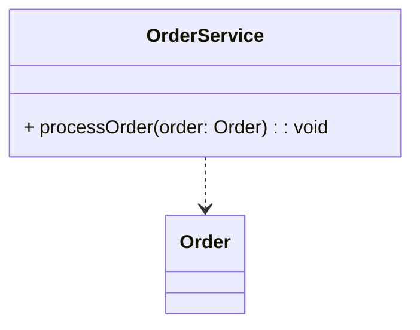
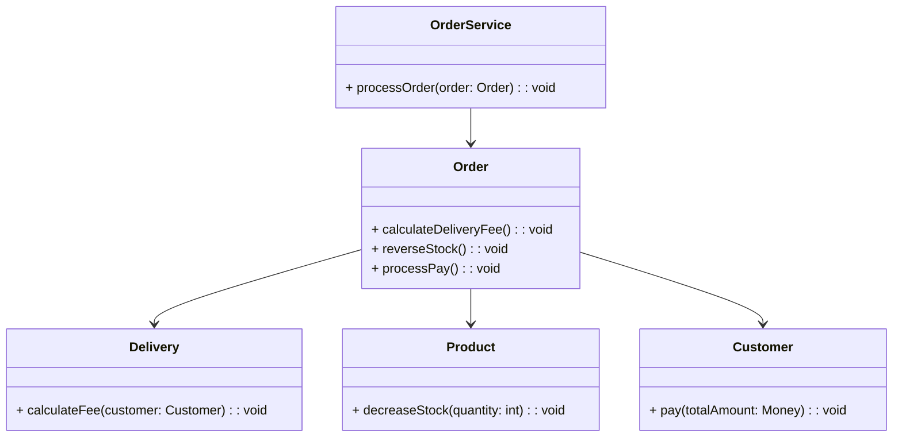

# stock_delivery 프로젝트 클래스 다이어그램

## 전체 클래스 다이어그램

전체 클래스 다이어그램은 재고와 배송비를 관리하는 주문 시스템을 보여줍니다.

```mermaid
classDiagram
    class OrderService {
        + processOrder(order: Order): void
    }

    class Order {
        - customer: Customer
        - items: List~OrderItem~
        - amount: Money
        - delivery: Delivery
        + calculateDeliveryFee(): void
        + reverseStock(): void
        + processPay(): void
        + getTotalAmount(): Money
    }

    OrderService --> Order
```

## 도메인 클래스

```mermaid
classDiagram
    class Customer {
        - id: Long
        - name: String
        - grade: Grade
        - paymentMethods: List~PaymentMethod~
        + isVipCustomer(): boolean
        + pay(totalAmount: Money): void
    }

    class Grade {
        - name: String
        + isVip(): boolean
    }

    class Order {
        - customer: Customer
        - items: List~OrderItem~
        - amount: Money
        - delivery: Delivery
        + calculateDeliveryFee(): void
        + reverseStock(): void
        + processPay(): void
        + getTotalAmount(): Money
    }

    class OrderItem {
        - product: Product
        - quantity: int
        + decreaseProductStock(): void
    }

    class Product {
        - id: Long
        - name: String
        - stock: Stock
        + isOutOfStock(quantity: int): boolean
        + decreaseStock(quantity: int): void
    }

    class Stock {
        - quantity: int
        + decrease(quantity: int): void
    }

    class Delivery {
        - fee: int
        + getFee(): Money
        + calculateFee(customer: Customer): void
    }

    class PaymentMethod {
        <<interface>>
        + charge(amount: Money): void
    }

    Customer "1" -- "1" Grade
    Customer "1" -- "*" PaymentMethod
    Order "1" -- "1" Customer
    Order "1" -- "*" OrderItem
    Order "1" -- "1" Delivery
    OrderItem "1" -- "1" Product
    Product "1" -- "1" Stock
    Delivery ..> Customer
```

## 서비스 계층

```mermaid
classDiagram
    class OrderService {
        + processOrder(order: Order): void
    }

    OrderService ..> Order
```

## 주문 처리 흐름

```mermaid
classDiagram
    class OrderService {
        + processOrder(order: Order): void
    }

    class Order {
        + calculateDeliveryFee(): void
        + reverseStock(): void
        + processPay(): void
    }

    class Delivery {
        + calculateFee(customer: Customer): void
    }

    class Product {
        + decreaseStock(quantity: int): void
    }

    class Customer {
        + pay(totalAmount: Money): void
    }

    OrderService --> Order
    Order --> Delivery
    Order --> Product
    Order --> Customer
```

