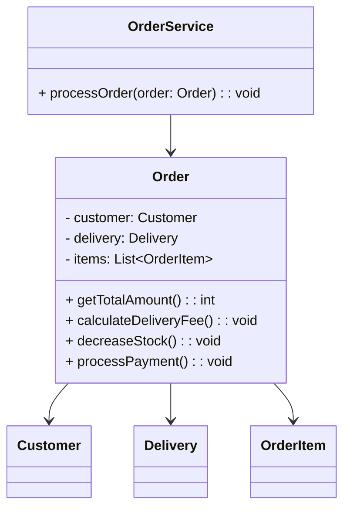
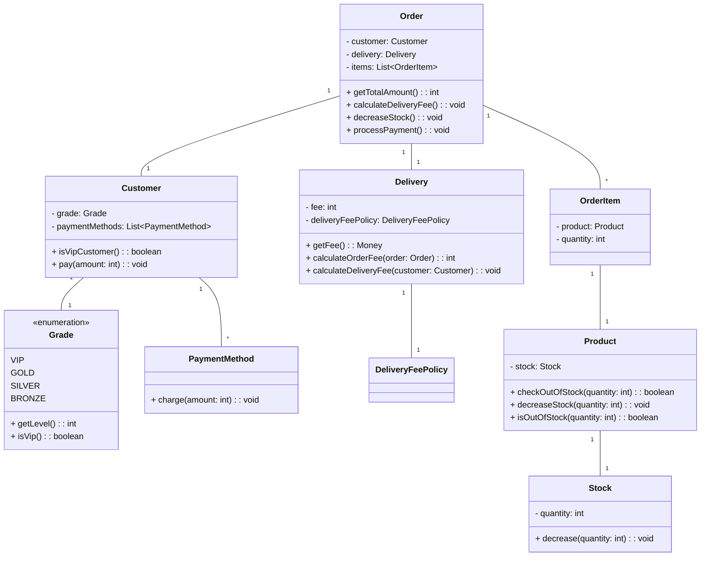
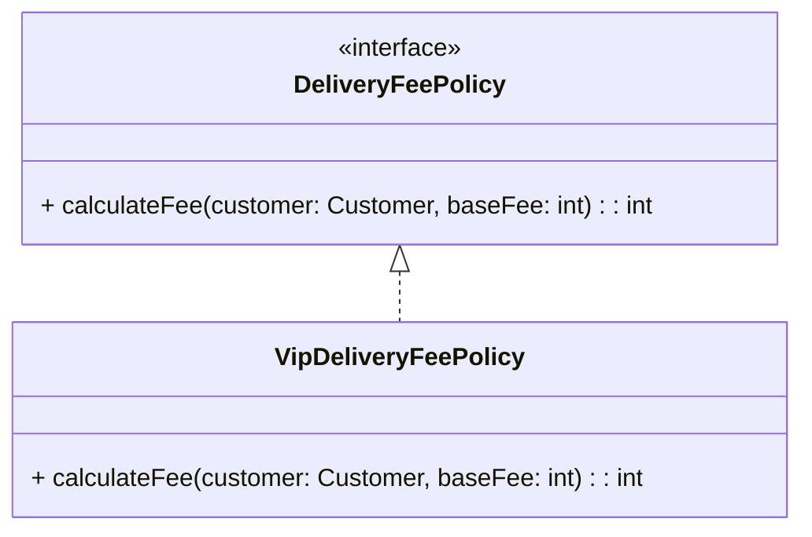
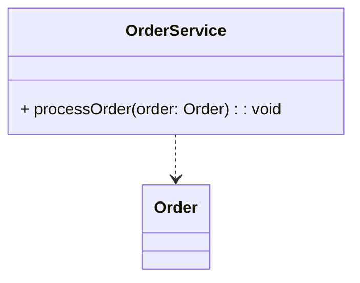
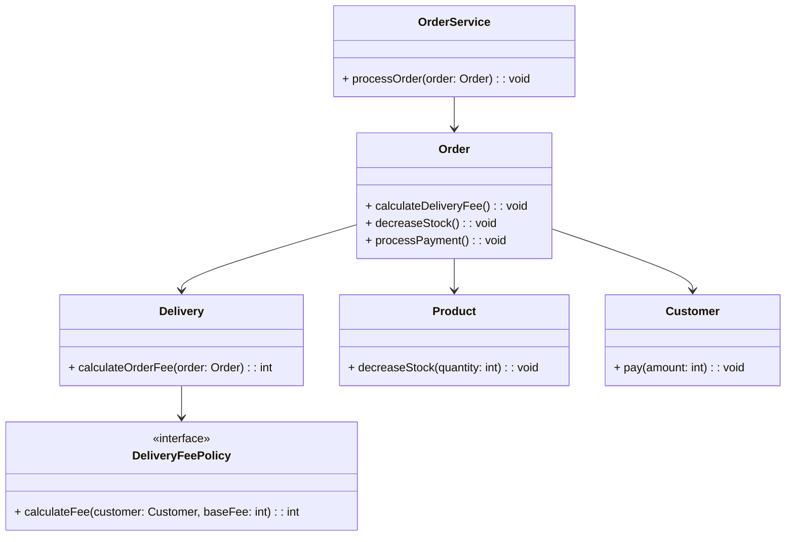

# claude6_1 프로젝트 클래스 다이어그램

## 전체 클래스 다이어그램

전체 클래스 다이어그램은 재고와 배송비를 관리하는 주문 시스템을 보여줍니다. 배송비 계산은 전략 패턴을 사용합니다.

```mermaid
classDiagram
    class OrderService {
        + processOrder(order: Order): void
    }

    class Order {
        - customer: Customer
        - delivery: Delivery
        - items: List~OrderItem~
        + getTotalAmount(): int
        + calculateDeliveryFee(): void
        + decreaseStock(): void
        + processPayment(): void
    }

    OrderService --> Order
    Order --> Customer
    Order --> Delivery
    Order --> OrderItem
```

## 도메인 클래스

```mermaid
classDiagram
    class Customer {
        - grade: Grade
        - paymentMethods: List~PaymentMethod~
        + isVipCustomer(): boolean
        + pay(amount: int): void
    }

    class Grade {
        <<enumeration>>
        VIP
        GOLD
        SILVER
        BRONZE
        + getLevel(): int
        + isVip(): boolean
    }

    class Order {
        - customer: Customer
        - delivery: Delivery
        - items: List~OrderItem~
        + getTotalAmount(): int
        + calculateDeliveryFee(): void
        + decreaseStock(): void
        + processPayment(): void
    }

    class OrderItem {
        - product: Product
        - quantity: int
    }

    class Product {
        - stock: Stock
        + checkOutOfStock(quantity: int): boolean
        + decreaseStock(quantity: int): void
        + isOutOfStock(quantity: int): boolean
    }

    class Stock {
        - quantity: int
        + decrease(quantity: int): void
    }

    class Delivery {
        - fee: int
        - deliveryFeePolicy: DeliveryFeePolicy
        + getFee(): Money
        + calculateOrderFee(order: Order): int
        + calculateDeliveryFee(customer: Customer): void
    }

    class PaymentMethod {
        + charge(amount: int): void
    }

    Customer "1" -- "1" Grade
    Customer "1" -- "*" PaymentMethod
    Order "1" -- "1" Customer
    Order "1" -- "1" Delivery
    Order "1" -- "*" OrderItem
    OrderItem "1" -- "1" Product
    Product "1" -- "1" Stock
    Delivery "1" -- "1" DeliveryFeePolicy
```

## 배송비 정책 도메인

```mermaid
classDiagram
    class DeliveryFeePolicy {
        <<interface>>
        + calculateFee(customer: Customer, baseFee: int): int
    }

    class VipDeliveryFeePolicy {
        + calculateFee(customer: Customer, baseFee: int): int
    }

    DeliveryFeePolicy <|.. VipDeliveryFeePolicy
```

## 서비스 계층

```mermaid
classDiagram
    class OrderService {
        + processOrder(order: Order): void
    }

    OrderService ..> Order
```

## 주문 처리 흐름

```mermaid
classDiagram
    class OrderService {
        + processOrder(order: Order): void
    }

    class Order {
        + calculateDeliveryFee(): void
        + decreaseStock(): void
        + processPayment(): void
    }

    class Delivery {
        + calculateOrderFee(order: Order): int
    }

    class DeliveryFeePolicy {
        <<interface>>
        + calculateFee(customer: Customer, baseFee: int): int
    }

    class Product {
        + decreaseStock(quantity: int): void
    }

    class Customer {
        + pay(amount: int): void
    }

    OrderService --> Order
    Order --> Delivery
    Delivery --> DeliveryFeePolicy
    Order --> Product
    Order --> Customer
```

