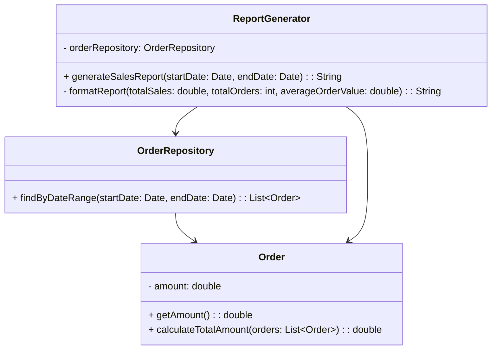
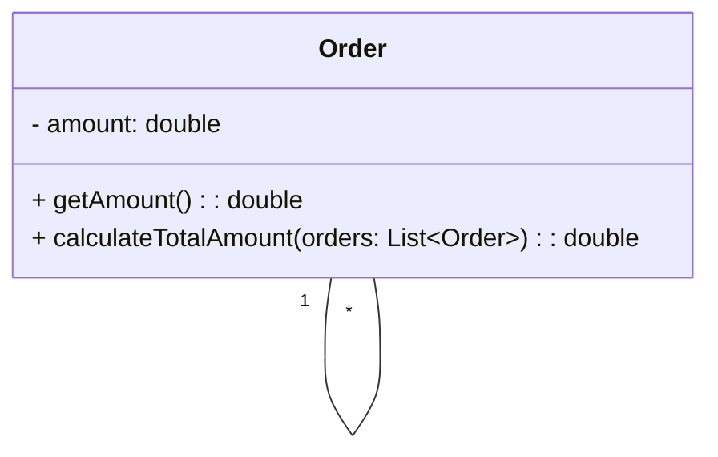
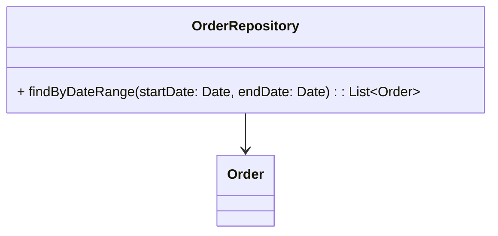
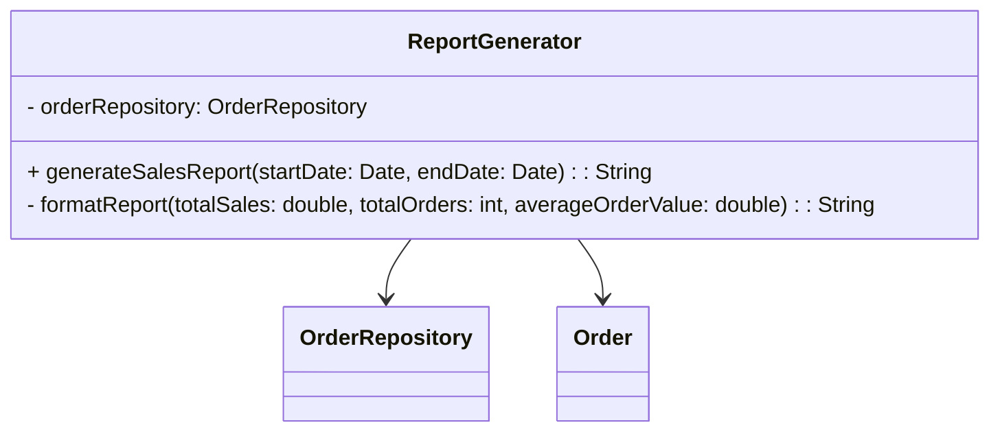
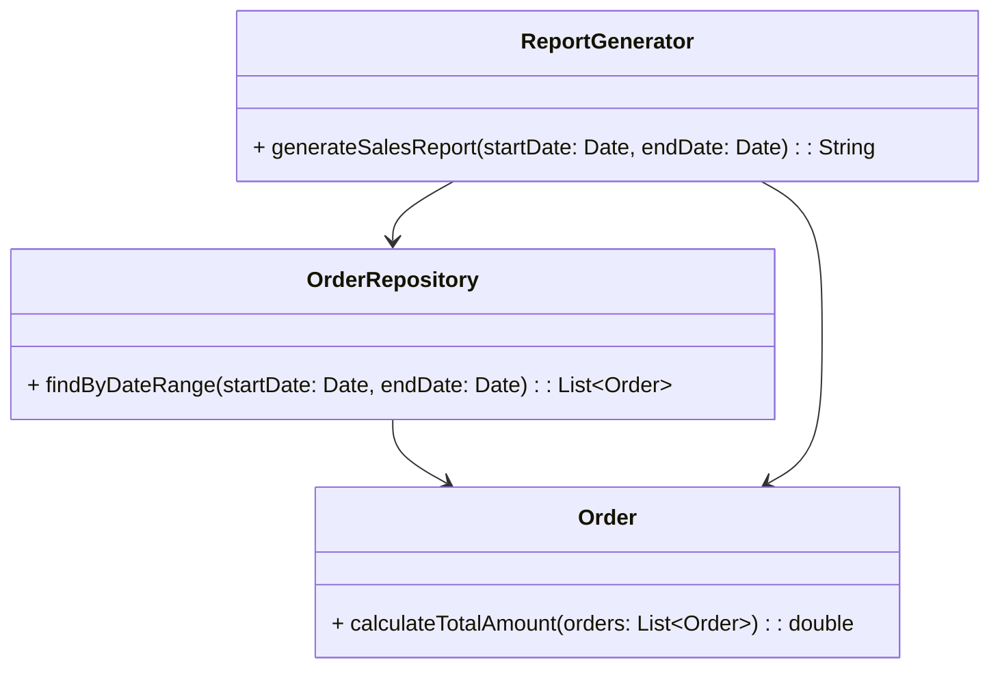

# claude6_2 프로젝트 클래스 다이어그램

## 전체 클래스 다이어그램

전체 클래스 다이어그램은 매출 보고서 생성 시스템을 보여줍니다.

```mermaid
classDiagram
    class ReportGenerator {
        - orderRepository: OrderRepository
        + generateSalesReport(startDate: Date, endDate: Date): String
        - formatReport(totalSales: double, totalOrders: int, averageOrderValue: double): String
    }

    class OrderRepository {
        + findByDateRange(startDate: Date, endDate: Date): List~Order~
    }

    class Order {
        - amount: double
        + getAmount(): double
        + calculateTotalAmount(orders: List~Order~): double
    }

    ReportGenerator --> OrderRepository
    OrderRepository --> Order
    ReportGenerator --> Order
```

## 도메인 클래스

```mermaid
classDiagram
    class Order {
        - amount: double
        + getAmount(): double
        + calculateTotalAmount(orders: List~Order~): double
    }

    Order "1" -- "*" Order
```

## 리포지토리 계층

```mermaid
classDiagram
    class OrderRepository {
        + findByDateRange(startDate: Date, endDate: Date): List~Order~
    }

    OrderRepository --> Order
```

## 서비스 계층

```mermaid
classDiagram
    class ReportGenerator {
        - orderRepository: OrderRepository
        + generateSalesReport(startDate: Date, endDate: Date): String
        - formatReport(totalSales: double, totalOrders: int, averageOrderValue: double): String
    }

    ReportGenerator --> OrderRepository
    ReportGenerator --> Order
```

## 보고서 생성 흐름

```mermaid
classDiagram
    class ReportGenerator {
        + generateSalesReport(startDate: Date, endDate: Date): String
    }

    class OrderRepository {
        + findByDateRange(startDate: Date, endDate: Date): List~Order~
    }

    class Order {
        + calculateTotalAmount(orders: List~Order~): double
    }

    ReportGenerator --> OrderRepository
    OrderRepository --> Order
    ReportGenerator --> Order
```

