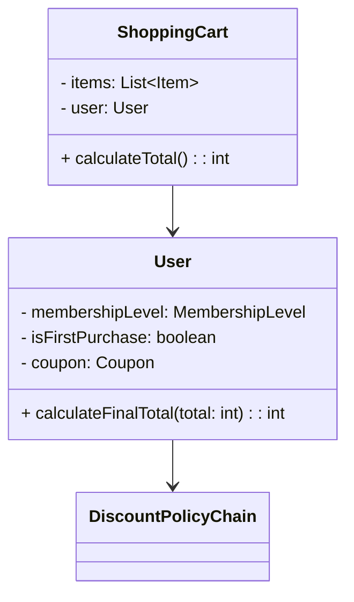
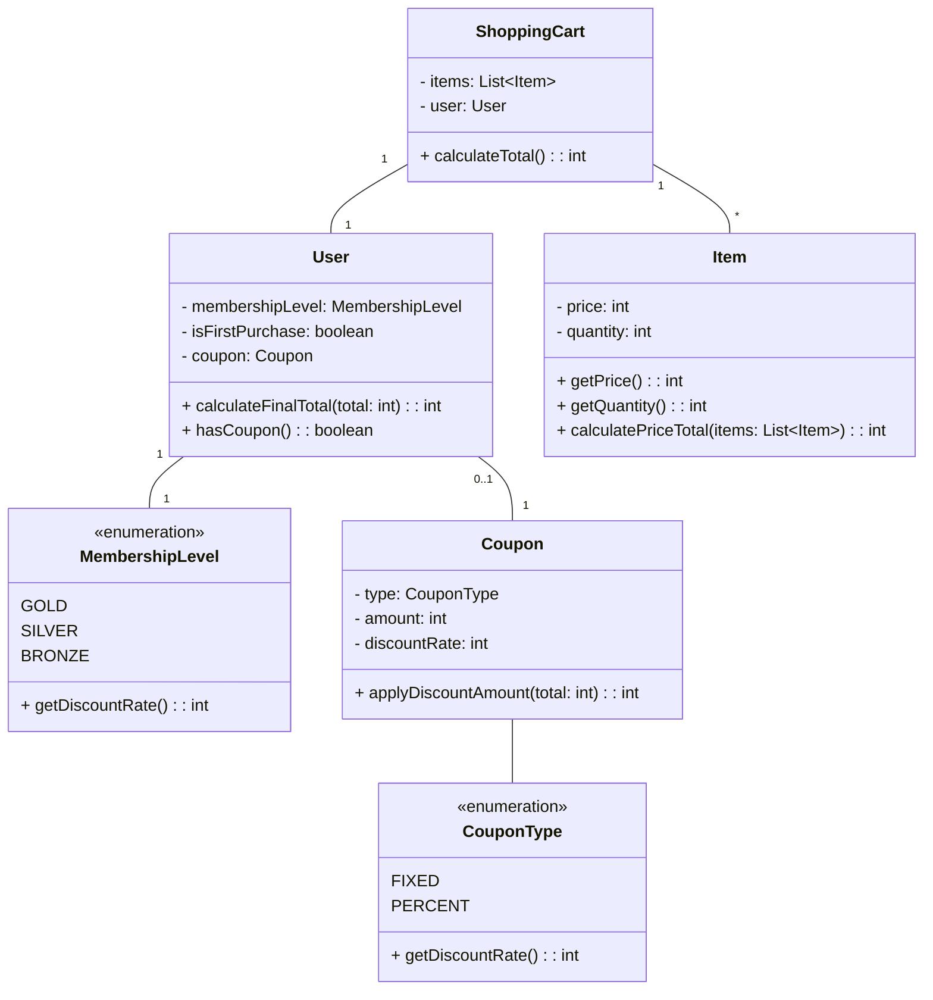
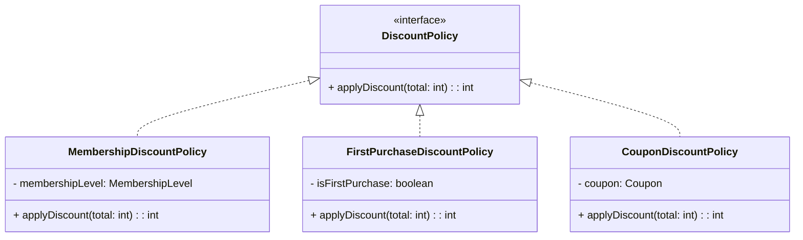
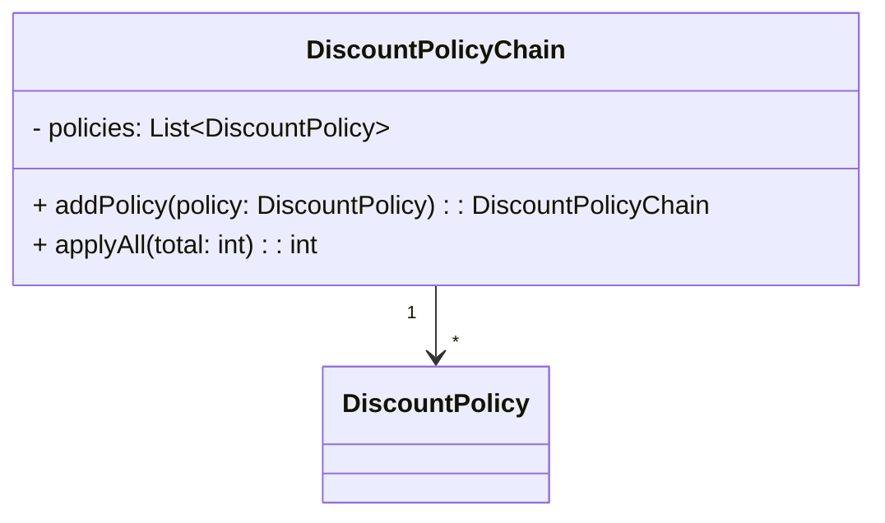
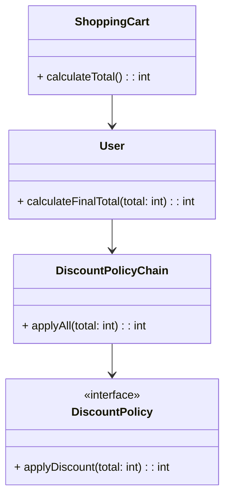
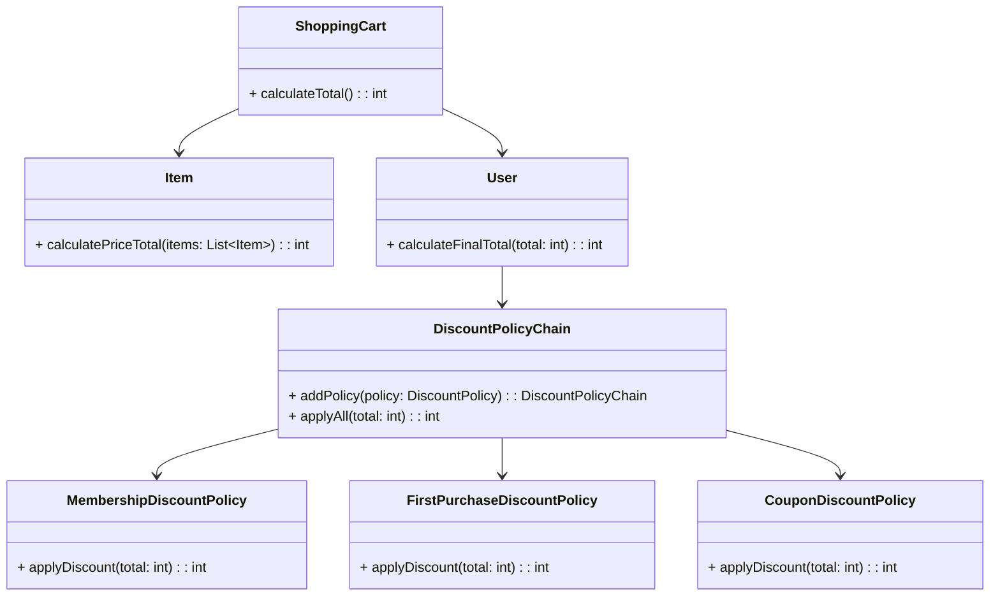

# claude6_3 프로젝트 클래스 다이어그램

## 전체 클래스 다이어그램

전체 클래스 다이어그램은 할인 정책을 적용하는 쇼핑카트 시스템을 보여줍니다. 할인 정책은 체인 패턴을 사용하여 순차적으로 적용됩니다.

## 도메인 클래스

## 할인 정책 도메인

## 할인 정책 체인 도메인

## 할인 계산 흐름

## 전체 할인 정책 적용 흐름

