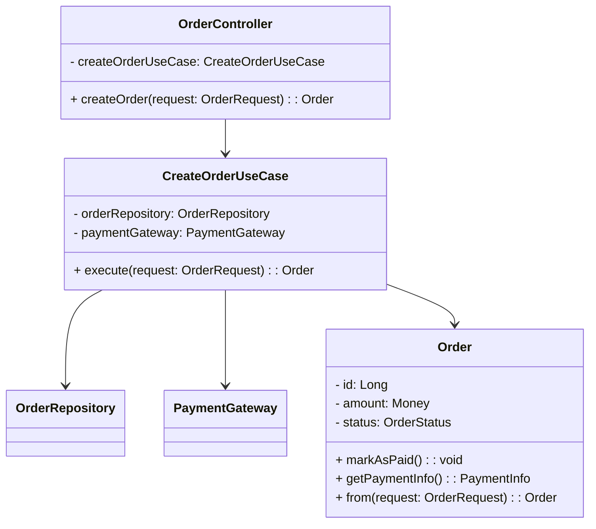
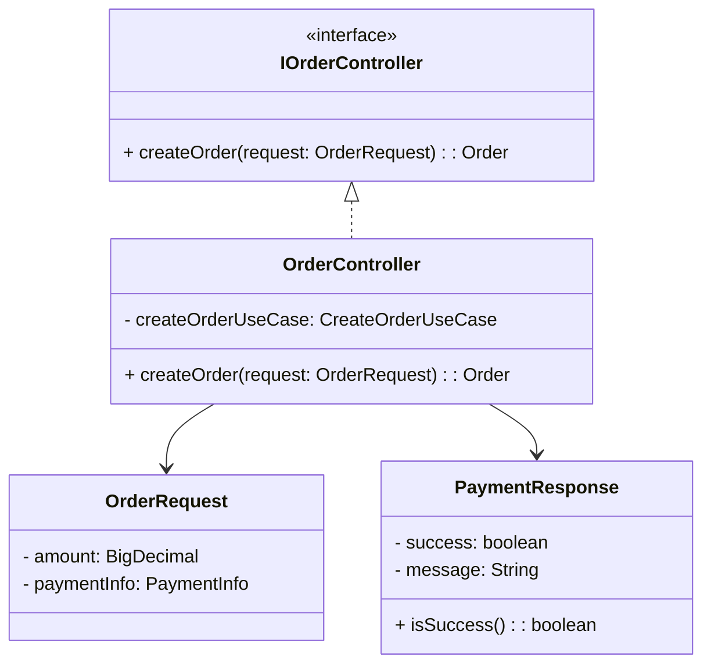
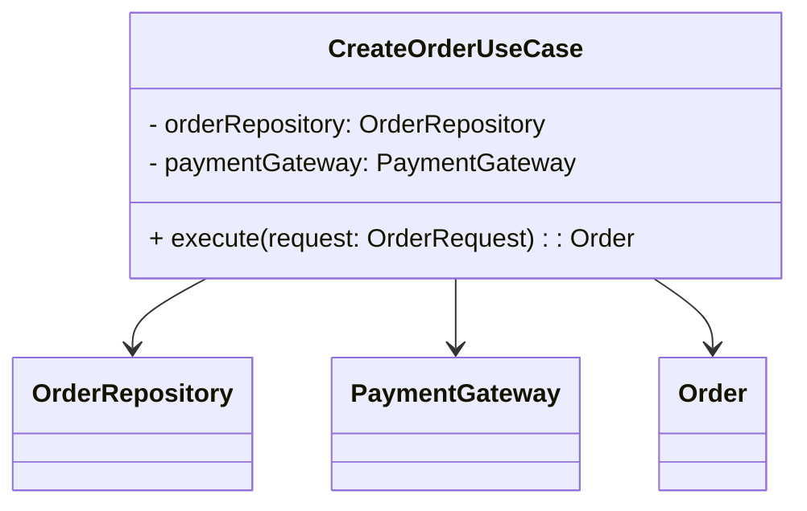
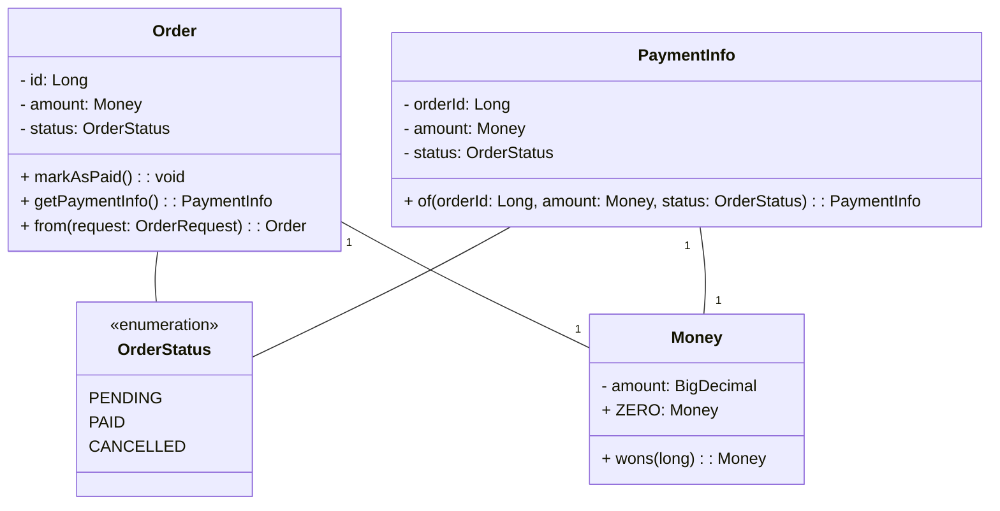
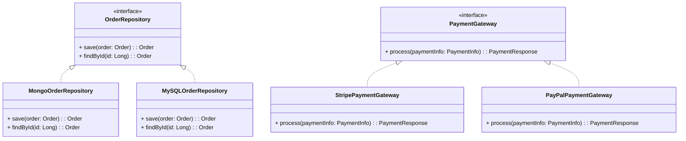
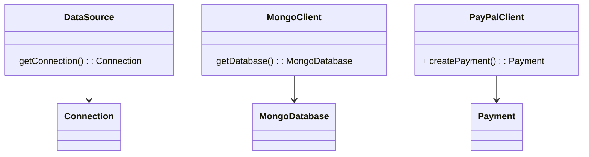
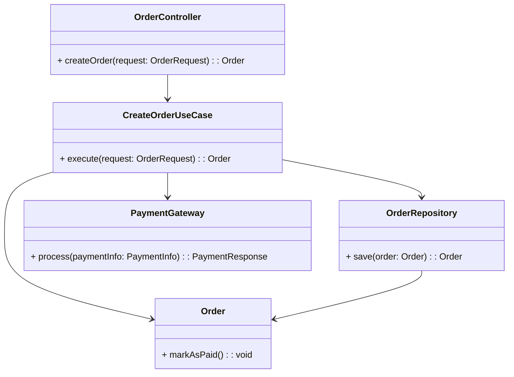

# spring_payment 프로젝트 클래스 다이어그램

## 전체 클래스 다이어그램

전체 클래스 다이어그램은 계층형 아키텍처를 사용하는 결제 시스템을 보여줍니다.

## 계층별 구조

### 인터페이스 계층 (Presentation Layer)

### 애플리케이션 계층 (Application Layer)

### 도메인 계층 (Domain Layer)

### 인프라스트럭처 계층 (Infrastructure Layer)

### 설정 계층 (Config Layer)

## 주문 생성 흐름

