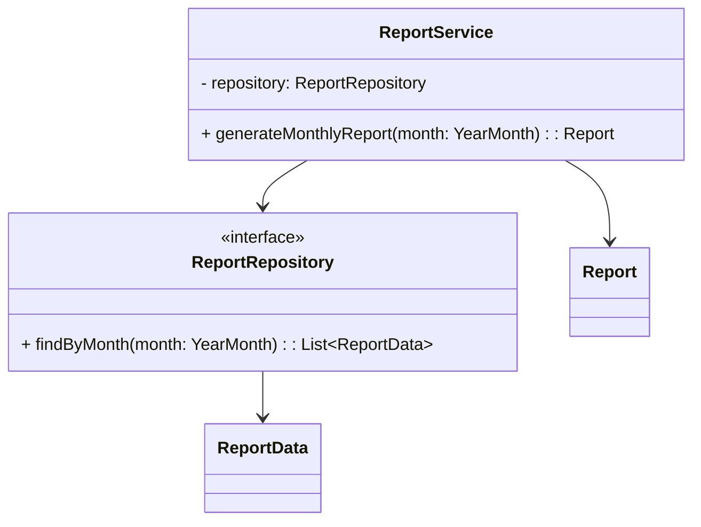
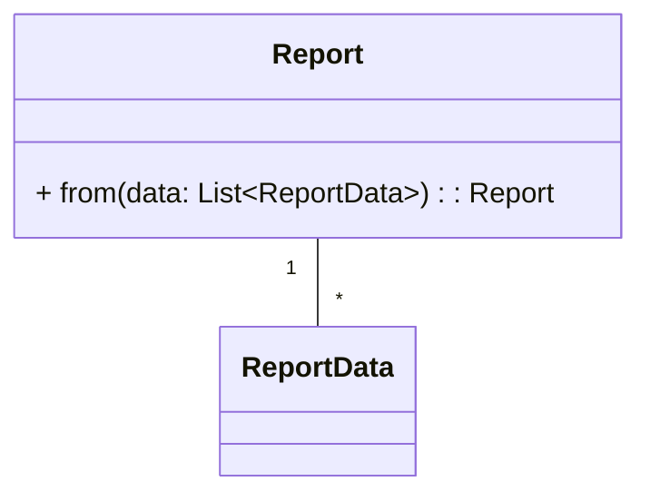
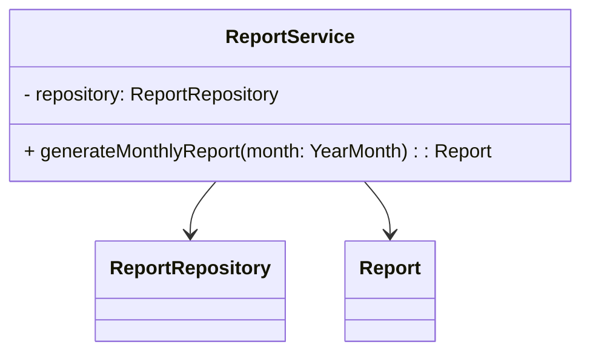
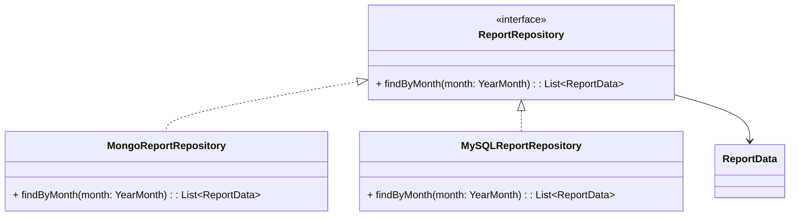
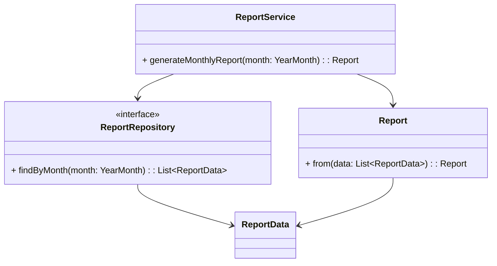

# sql 프로젝트 클래스 다이어그램

## 전체 클래스 다이어그램

전체 클래스 다이어그램은 리포트 저장소 추상화 시스템을 보여줍니다.

```mermaid
classDiagram
    class ReportService {
        - repository: ReportRepository
        + generateMonthlyReport(month: YearMonth): Report
    }

    class ReportRepository {
        <<interface>>
        + findByMonth(month: YearMonth): List~ReportData~
    }

    ReportService --> ReportRepository
    ReportRepository --> ReportData
    ReportService --> Report
```

## 도메인 클래스

```mermaid
classDiagram
    class Report {
        + from(data: List~ReportData~): Report
    }

    class ReportData {
    }

    Report "1" -- "*" ReportData
```

## 서비스 계층

```mermaid
classDiagram
    class ReportService {
        - repository: ReportRepository
        + generateMonthlyReport(month: YearMonth): Report
    }

    ReportService --> ReportRepository
    ReportService --> Report
```

## 리포지토리 계층

```mermaid
classDiagram
    class ReportRepository {
        <<interface>>
        + findByMonth(month: YearMonth): List~ReportData~
    }

    class MongoReportRepository {
        + findByMonth(month: YearMonth): List~ReportData~
    }

    class MySQLReportRepository {
        + findByMonth(month: YearMonth): List~ReportData~
    }

    ReportRepository <|.. MongoReportRepository
    ReportRepository <|.. MySQLReportRepository
    ReportRepository --> ReportData
```

## 리포트 생성 흐름

```mermaid
classDiagram
    class ReportService {
        + generateMonthlyReport(month: YearMonth): Report
    }

    class ReportRepository {
        <<interface>>
        + findByMonth(month: YearMonth): List~ReportData~
    }

    class Report {
        + from(data: List~ReportData~): Report
    }

    ReportService --> ReportRepository
    ReportRepository --> ReportData
    ReportService --> Report
    Report --> ReportData
```

