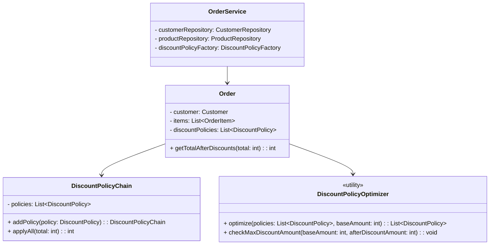
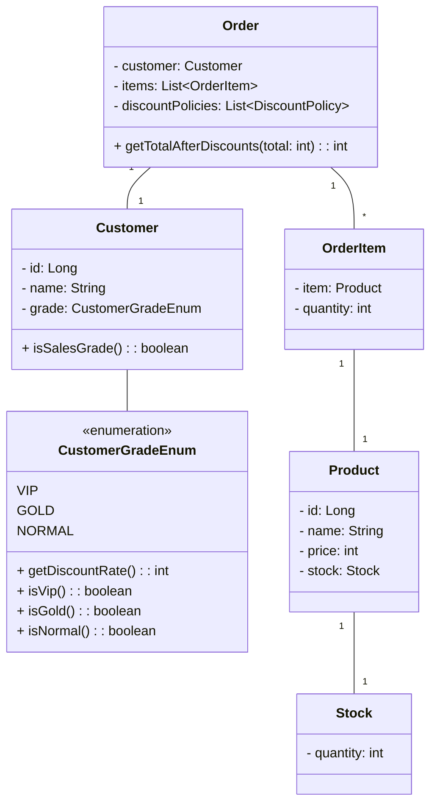
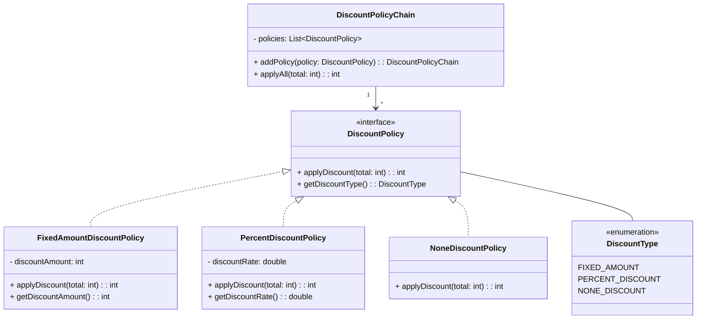
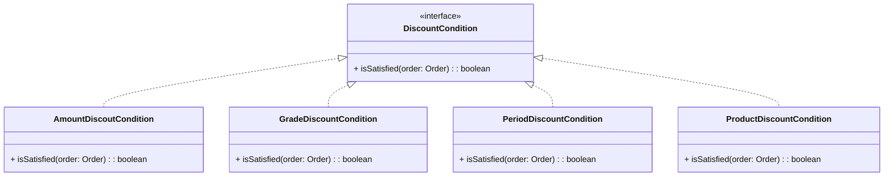
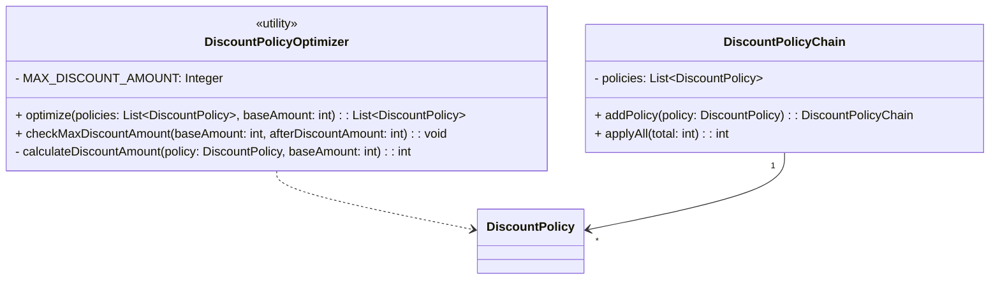
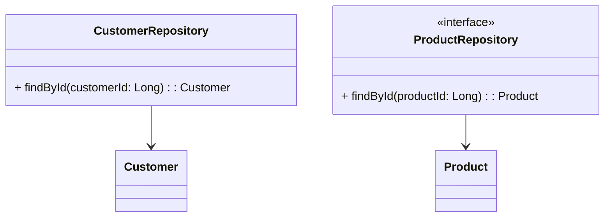
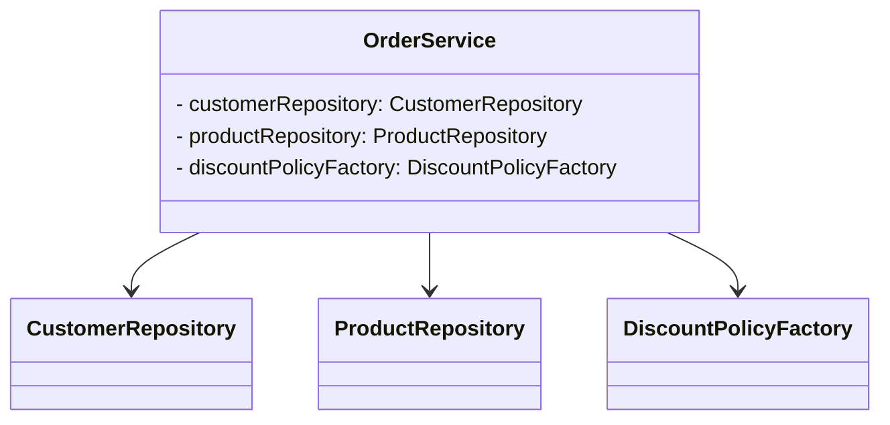

# final_prjct 프로젝트 클래스 다이어그램

## 전체 클래스 다이어그램

전체 클래스 다이어그램은 할인 정책 체인과 최적화를 사용하는 주문 시스템을 보여줍니다.

```mermaid
classDiagram
    class OrderService {
        - customerRepository: CustomerRepository
        - productRepository: ProductRepository
        - discountPolicyFactory: DiscountPolicyFactory
    }

    class Order {
        - customer: Customer
        - items: List~OrderItem~
        - discountPolicies: List~DiscountPolicy~
        + getTotalAfterDiscounts(total: int): int
    }

    class DiscountPolicyChain {
        - policies: List~DiscountPolicy~
        + addPolicy(policy: DiscountPolicy): DiscountPolicyChain
        + applyAll(total: int): int
    }

    class DiscountPolicyOptimizer {
        <<utility>>
        + optimize(policies: List~DiscountPolicy~, baseAmount: int): List~DiscountPolicy~
        + checkMaxDiscountAmount(baseAmount: int, afterDiscountAmount: int): void
    }

    OrderService --> Order
    Order --> DiscountPolicyChain
    Order --> DiscountPolicyOptimizer
```

## 도메인 클래스

```mermaid
classDiagram
    class Customer {
        - id: Long
        - name: String
        - grade: CustomerGradeEnum
        + isSalesGrade(): boolean
    }

    class CustomerGradeEnum {
        <<enumeration>>
        VIP
        GOLD
        NORMAL
        + getDiscountRate(): int
        + isVip(): boolean
        + isGold(): boolean
        + isNormal(): boolean
    }

    class Order {
        - customer: Customer
        - items: List~OrderItem~
        - discountPolicies: List~DiscountPolicy~
        + getTotalAfterDiscounts(total: int): int
    }

    class OrderItem {
        - item: Product
        - quantity: int
    }

    class Product {
        - id: Long
        - name: String
        - price: int
        - stock: Stock
    }

    class Stock {
        - quantity: int
    }

    Customer -- CustomerGradeEnum
    Order "1" -- "1" Customer
    Order "1" -- "*" OrderItem
    OrderItem "1" -- "1" Product
    Product "1" -- "1" Stock
```

## 할인 정책 도메인

```mermaid
classDiagram
    class DiscountPolicy {
        <<interface>>
        + applyDiscount(total: int): int
        + getDiscountType(): DiscountType
    }

    class DiscountType {
        <<enumeration>>
        FIXED_AMOUNT
        PERCENT_DISCOUNT
        NONE_DISCOUNT
    }

    class FixedAmountDiscountPolicy {
        - discountAmount: int
        + applyDiscount(total: int): int
        + getDiscountAmount(): int
    }

    class PercentDiscountPolicy {
        - discountRate: double
        + applyDiscount(total: int): int
        + getDiscountRate(): double
    }

    class NoneDiscountPolicy {
        + applyDiscount(total: int): int
    }

    class DiscountPolicyChain {
        - policies: List~DiscountPolicy~
        + addPolicy(policy: DiscountPolicy): DiscountPolicyChain
        + applyAll(total: int): int
    }

    DiscountPolicy <|.. FixedAmountDiscountPolicy
    DiscountPolicy <|.. PercentDiscountPolicy
    DiscountPolicy <|.. NoneDiscountPolicy
    DiscountPolicyChain "1" --> "*" DiscountPolicy
    DiscountPolicy -- DiscountType
```

## 할인 조건 도메인

```mermaid
classDiagram
    class DiscountCondition {
        <<interface>>
        + isSatisfied(order: Order): boolean
    }

    class AmountDiscoutCondition {
        + isSatisfied(order: Order): boolean
    }

    class GradeDiscountCondition {
        + isSatisfied(order: Order): boolean
    }

    class PeriodDiscountCondition {
        + isSatisfied(order: Order): boolean
    }

    class ProductDiscountCondition {
        + isSatisfied(order: Order): boolean
    }

    DiscountCondition <|.. AmountDiscoutCondition
    DiscountCondition <|.. GradeDiscountCondition
    DiscountCondition <|.. PeriodDiscountCondition
    DiscountCondition <|.. ProductDiscountCondition
```

## 공통 유틸리티

```mermaid
classDiagram
    class DiscountPolicyOptimizer {
        <<utility>>
        - MAX_DISCOUNT_AMOUNT: Integer
        + optimize(policies: List~DiscountPolicy~, baseAmount: int): List~DiscountPolicy~
        + checkMaxDiscountAmount(baseAmount: int, afterDiscountAmount: int): void
        - calculateDiscountAmount(policy: DiscountPolicy, baseAmount: int): int
    }

    class DiscountPolicyChain {
        - policies: List~DiscountPolicy~
        + addPolicy(policy: DiscountPolicy): DiscountPolicyChain
        + applyAll(total: int): int
    }

    DiscountPolicyOptimizer ..> DiscountPolicy
    DiscountPolicyChain "1" --> "*" DiscountPolicy
```

## 리포지토리 계층

```mermaid
classDiagram
    class CustomerRepository {
        + findById(customerId: Long): Customer
    }

    class ProductRepository {
        <<interface>>
        + findById(productId: Long): Product
    }

    CustomerRepository --> Customer
    ProductRepository --> Product
```

## 서비스 계층

```mermaid
classDiagram
    class OrderService {
        - customerRepository: CustomerRepository
        - productRepository: ProductRepository
        - discountPolicyFactory: DiscountPolicyFactory
    }

    class DiscountPolicyFactory {
    }

    OrderService --> CustomerRepository
    OrderService --> ProductRepository
    OrderService --> DiscountPolicyFactory
```

