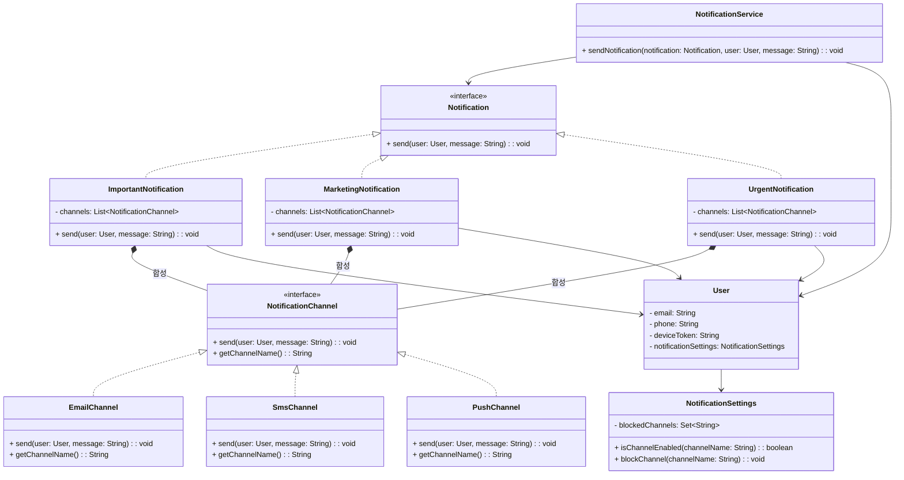
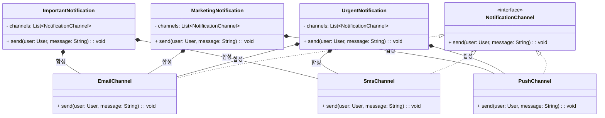
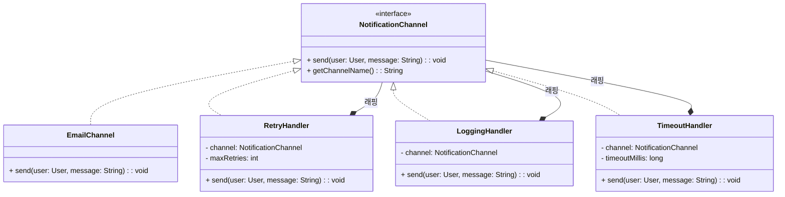
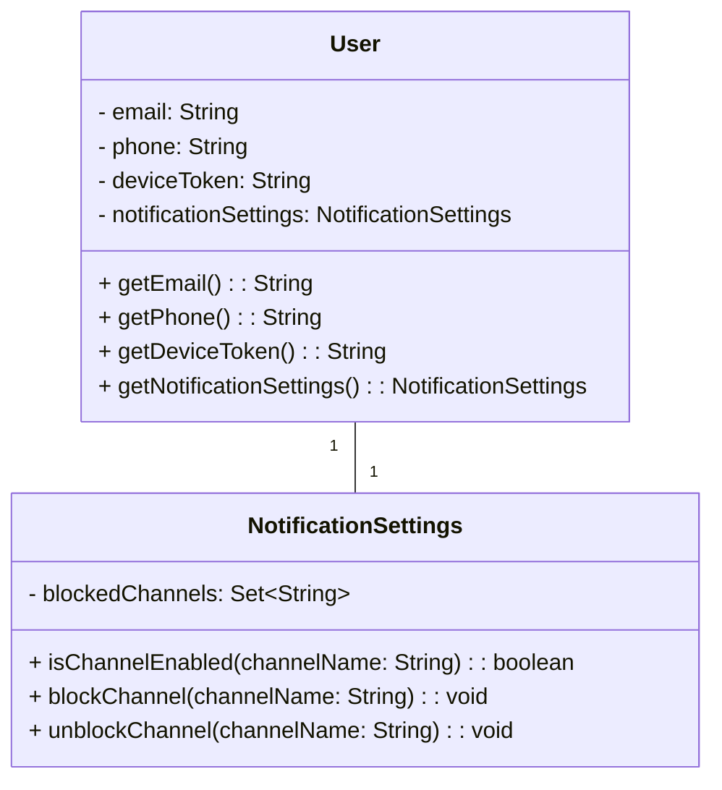
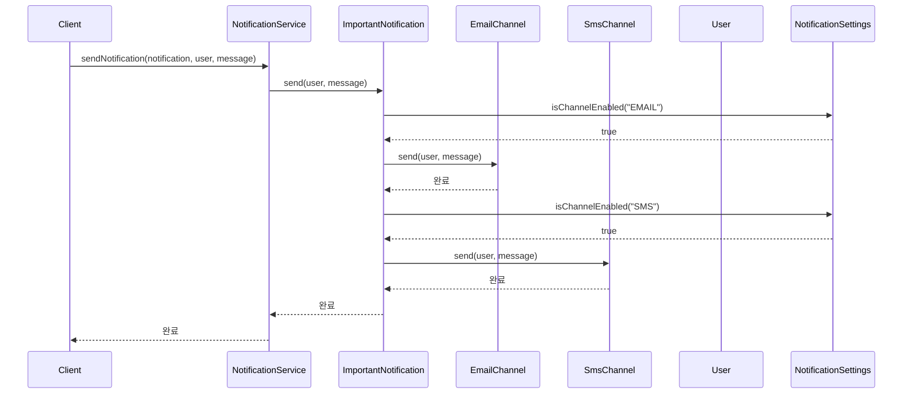
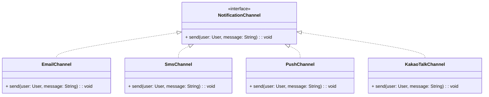

# notification 프로젝트 클래스 다이어그램

## 전체 클래스 다이어그램

전체 클래스 다이어그램은 합성 패턴을 사용한 알림 전송 시스템을 보여줍니다.

## 합성 패턴 구조

## 데코레이터 패턴 구조 (부가 기능)

## 도메인 클래스

## 알림 전송 흐름

## 확장성 예시: 카카오톡 채널 추가

**확장 방법:**
1. `KakaoTalkChannel` 클래스만 추가 (기존 채널과 동일한 구조)
2. 알림 타입의 `channels` 리스트에 추가만 하면 됨
3. 기존 코드 수정 불필요

