# payment_order_point 프로젝트 클래스 다이어그램

## 전체 클래스 다이어그램

전체 클래스 다이어그램은 포인트 결제를 포함한 복합 결제 시스템을 보여줍니다.

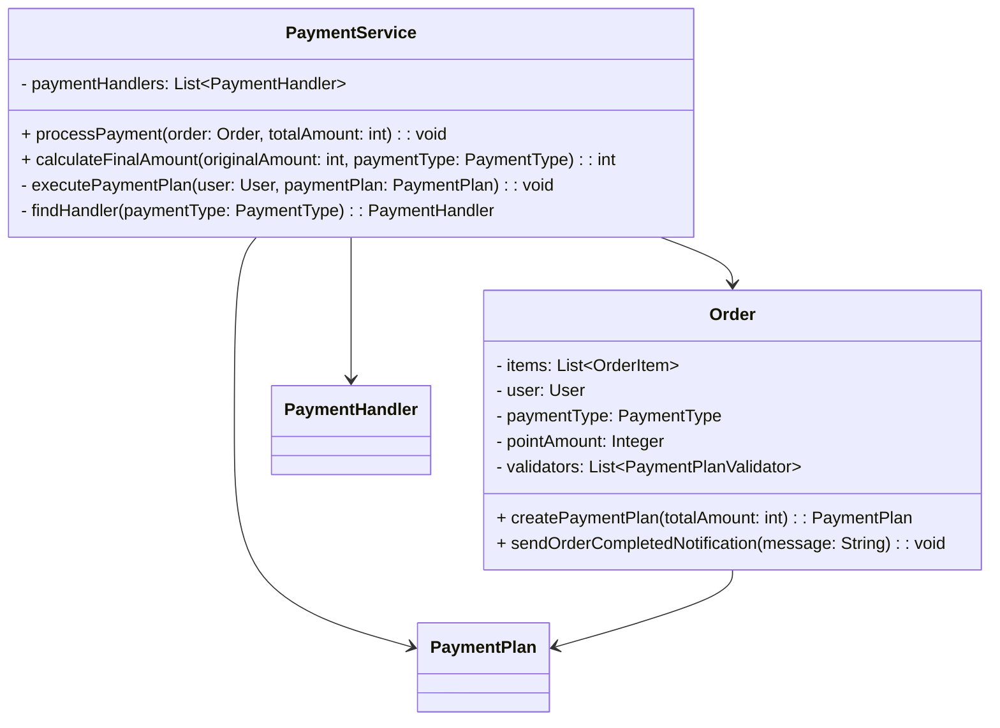

## 도메인 클래스

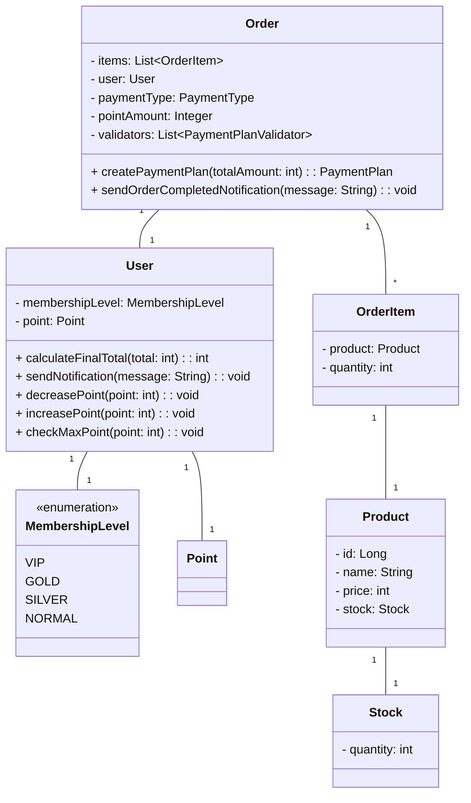

## 결제 계획 도메인

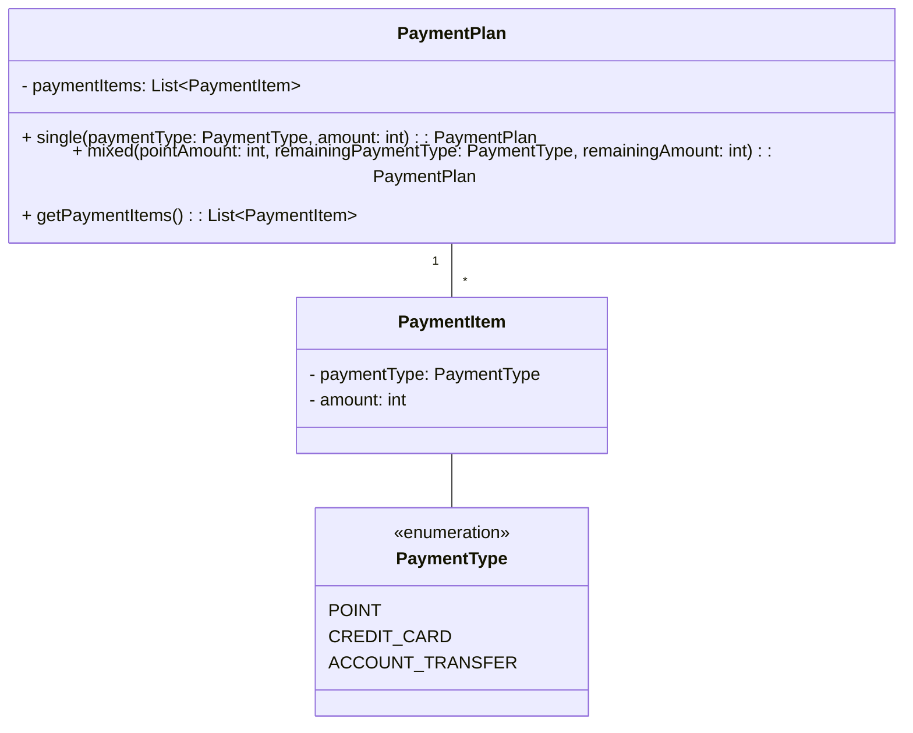

## 결제 핸들러 도메인

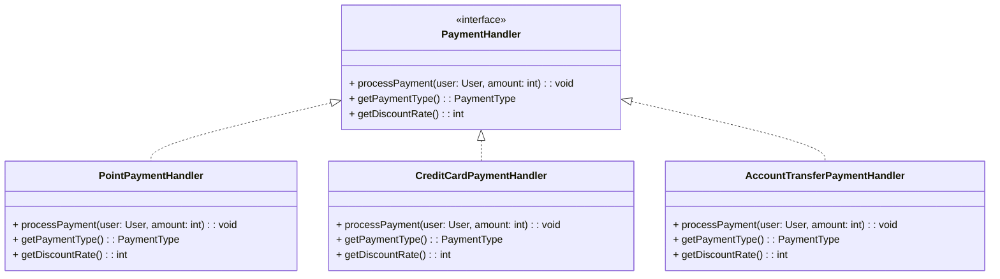

## 결제 계획 검증 도메인

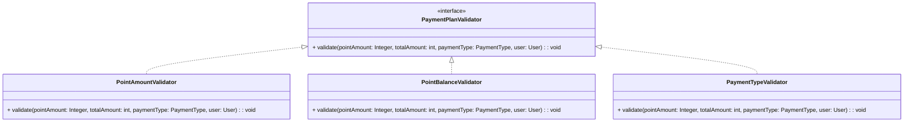

## 포인트 도메인

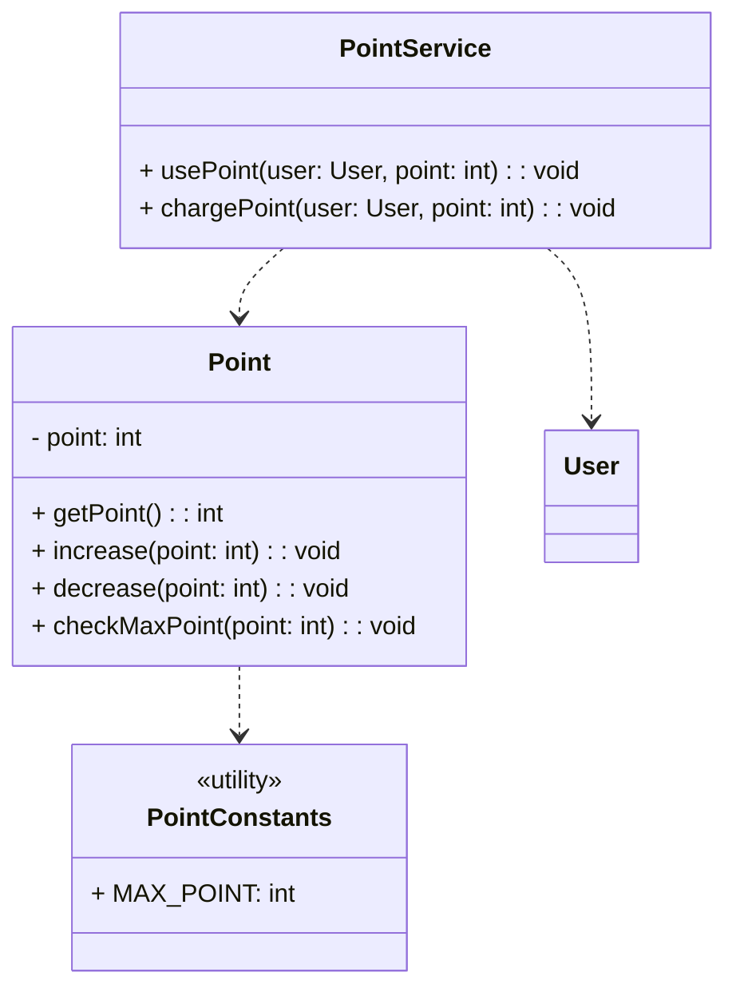

## 할인 정책 도메인

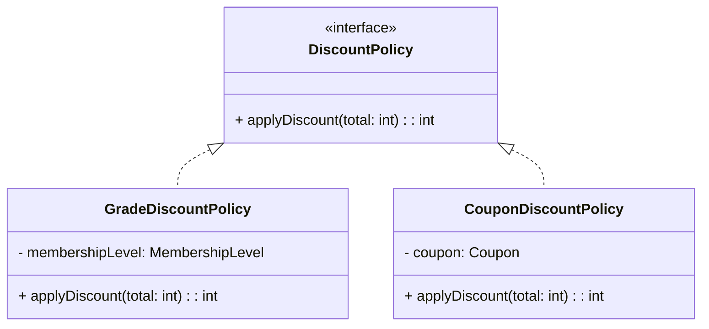

## 쿠폰 도메인

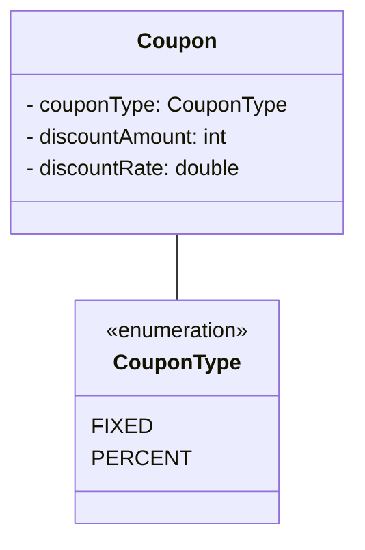

## 알림 도메인

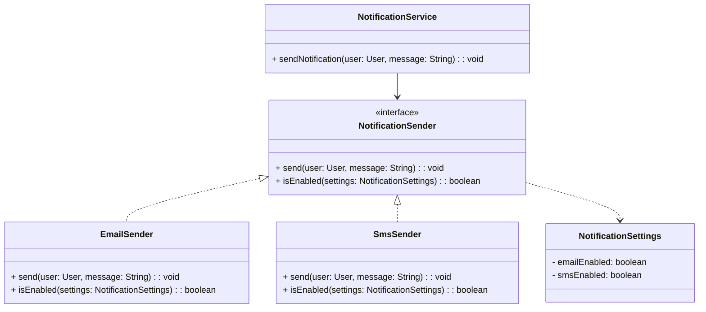

## 리포트 도메인

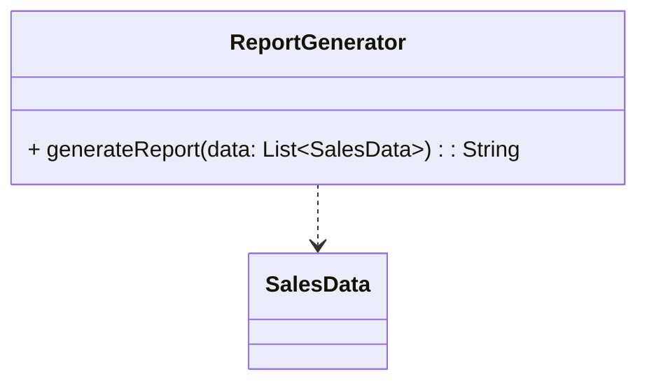

## 서비스 계층

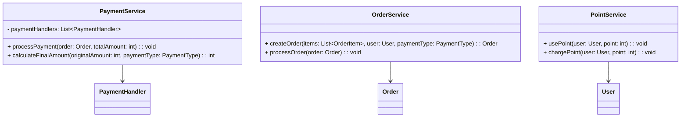

## 결제 처리 흐름

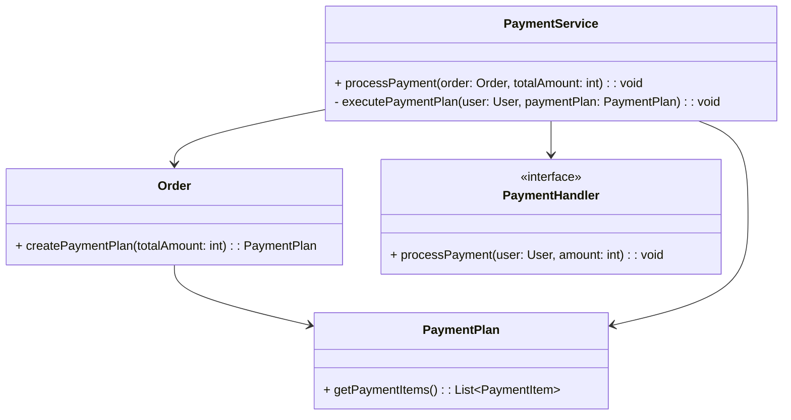

