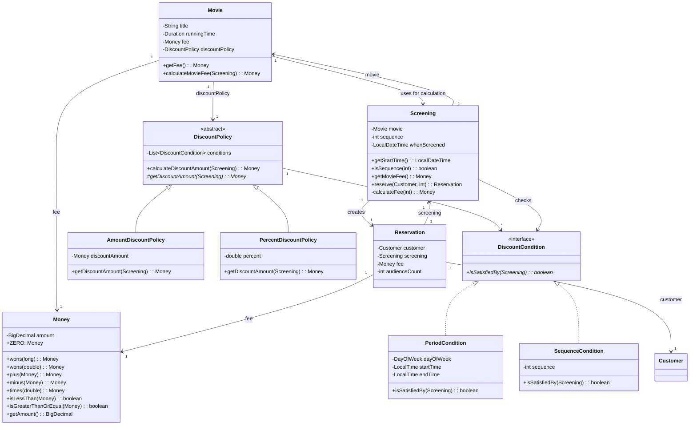
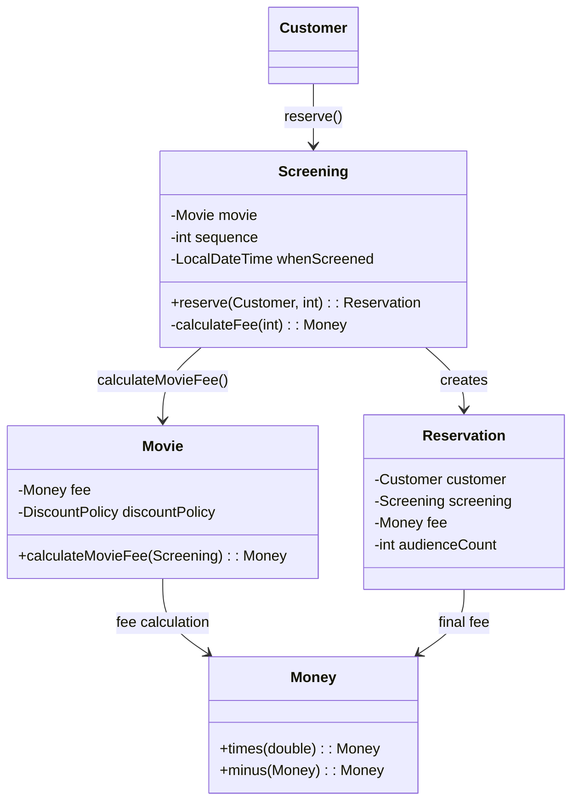

# Theater 프로젝트 클래스 다이어그램

## 전체 클래스 다이어그램

전체 클래스 다이어그램은 v4 버전의 주요 클래스와 그 관계를 보여줍니다.



## 핵심 클래스 상세 다이어그램

### 할인 정책 및 할인 조건

```mermaid
classDiagram
    class DiscountPolicy {
        <<abstract>>
        -List~DiscountCondition~ conditions
        +calculateDiscountAmount(Screening): Money
        #getDiscountAmount(Screening)*: Money
    }

    class AmountDiscountPolicy {
        -Money discountAmount
        +getDiscountAmount(Screening): Money
    }

    class PercentDiscountPolicy {
        -double percent
        +getDiscountAmount(Screening): Money
    }

    class DiscountCondition {
        <<interface>>
        +isSatisfiedBy(Screening)*: boolean
    }

    class PeriodCondition {
        -DayOfWeek dayOfWeek
        -LocalTime startTime
        -LocalTime endTime
        +isSatisfiedBy(Screening): boolean
    }

    class SequenceCondition {
        -int sequence
        +isSatisfiedBy(Screening): boolean
    }

    DiscountPolicy <|-- AmountDiscountPolicy : extends
    DiscountPolicy <|-- PercentDiscountPolicy : extends
    DiscountPolicy "1" --> "*" DiscountCondition : contains
    DiscountCondition <|.. PeriodCondition : implements
    DiscountCondition <|.. SequenceCondition : implements
```



### 예매 흐름



## 클래스 간 의존성 설명

### 1. Movie와 DiscountPolicy
- `Movie`는 `DiscountPolicy` 추상 클래스에 의존합니다.
- 구체적인 할인 정책(`AmountDiscountPolicy`, `PercentDiscountPolicy`)에 직접 의존하지 않아 **의존성 역전 원칙(DIP)**을 준수합니다.

### 2. DiscountPolicy와 DiscountCondition
- `DiscountPolicy`는 `DiscountCondition` 인터페이스에 의존합니다.
- 구체적인 할인 조건(`PeriodCondition`, `SequenceCondition`)에 직접 의존하지 않아 **의존성 역전 원칙(DIP)**을 준수합니다.

### 3. Screening과 Movie
- `Screening`은 `Movie`에 의존하여 영화 정보와 요금 계산을 수행합니다.
- 예매 시 `Movie`의 `calculateMovieFee()` 메서드를 호출합니다.

### 4. Money 값 객체
- `Money`는 불변 값 객체로, 모든 금액 계산은 새로운 `Money` 객체를 반환합니다.
- `Movie`, `Screening`, `Reservation` 등에서 금액을 표현하는 데 사용됩니다.

## 다형성 활용

### 1. 할인 정책 다형성
```java
// Movie는 DiscountPolicy 추상 클래스에 의존
Movie movie = new Movie(
    "아바타",
    Duration.ofMinutes(120),
    Money.wons(10000),
    new AmountDiscountPolicy(...)  // 또는 PercentDiscountPolicy
);
```

### 2. 할인 조건 다형성
```java
// DiscountPolicy는 DiscountCondition 인터페이스에 의존
DiscountPolicy policy = new AmountDiscountPolicy(
    Money.wons(800),
    new SequenceCondition(1),      // 또는 PeriodCondition
    new PeriodCondition(...)
);
```

이러한 다형성 설계를 통해 새로운 할인 정책이나 할인 조건을 추가할 때 기존 코드 수정 없이 확장할 수 있습니다.

